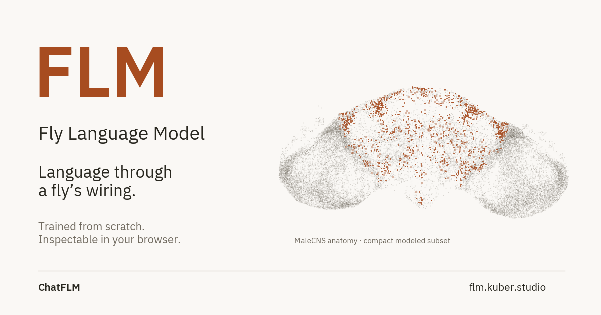
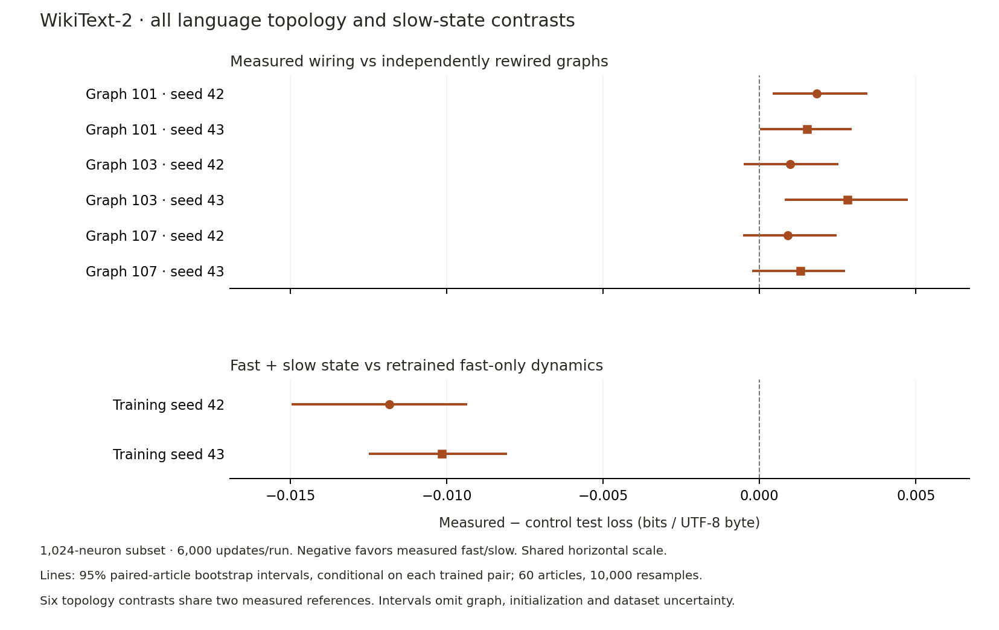
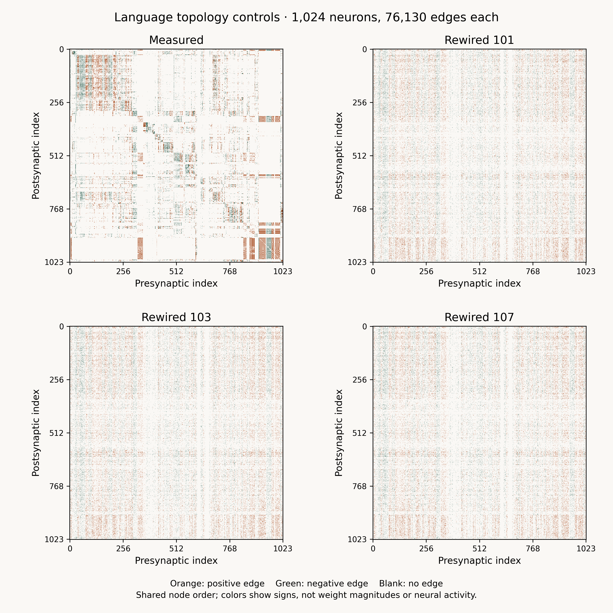
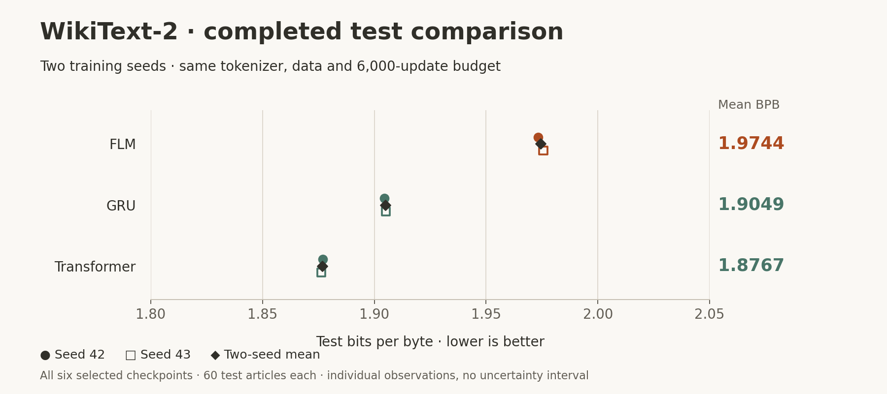
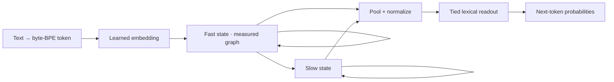
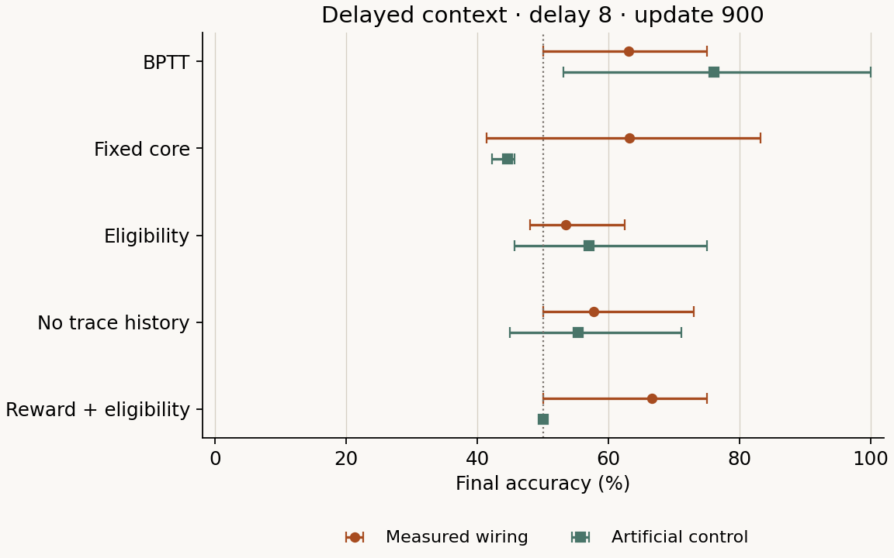
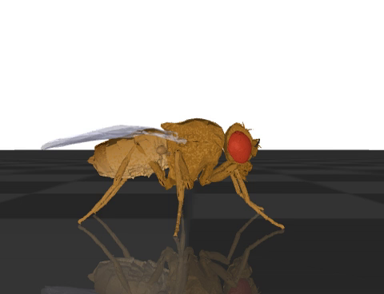
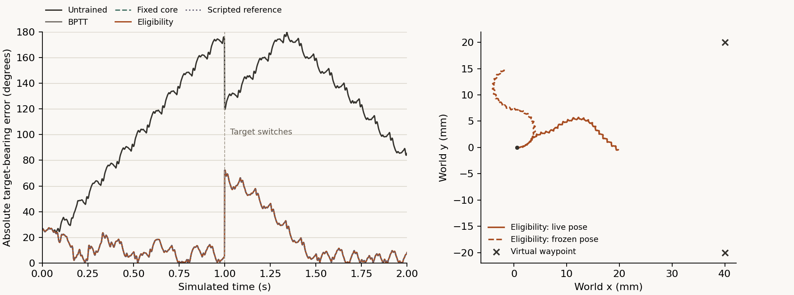

# FLM · Fly Language Model

**[Open ChatFLM](https://flm.kuber.studio)** · [Research papers](#papers-and-evidence) · [Run locally](#run-chatflm-locally) · [Compare all three models](#try-flm-gru-and-transformer) · [Research basis](docs/RESEARCH.md)

[](https://flm.kuber.studio)

**Can measured neural wiring provide a useful prior for language learning?** FLM is a small recurrent next-token predictor by **Kuber Mehta**. It learns from scratch within a declared subset of the fruit-fly connectome.

ChatFLM runs inference in your browser, with token probabilities, actual neural state in 3D, neuron interventions and a separate readout adapter. The models generate continuations with limited coherence; they have no instruction-following training.

## Completed wiring test

**No anatomical language advantage was demonstrated for this selected subset and setup.** All six measured-minus-rewired test effects are positive: mean **+0.001559 BPB**, range **+0.000911 to +0.002809**. The implemented slow-state branch helps against retrained no-slow models: mean **−0.010999 BPB**.



*Differences are measured fast/slow FLM minus the control; negative favors measured fast/slow. Lines show 95% paired-article bootstrap intervals, conditional on each fitted pair.*

| Control | Training seed 42: Δ BPB | Training seed 43: Δ BPB |
|---|---:|---:|
| Rewired graph 101 | +0.001830 | +0.001523 |
| Rewired graph 103 | +0.000981 | +0.002809 |
| Rewired graph 107 | +0.000911 | +0.001298 |
| Retrained no-slow state | −0.011836 | −0.010163 |

Three of six topology intervals include zero. The three graphs × two training seeds share two measured references; these are not six independent replications. This exploratory extension follows inspection of the original test scores. It does not establish that anatomy is generally harmful, and it does not estimate a topology-by-slow-state interaction.

All ten [checkpoint selections](reports/language-topology/selection.json) were frozen before new control test scoring, after 6,000 updates per run. Every run was scored on all 60 test articles. Inspect the [complete scores](public/research/language-topology-results.json), [records archive](https://flm.kuber.studio/research/language-topology-records.zip) and [release audit](reports/language-topology/records-release.json).

<details>
<summary>Matching, graph matrices and allocated versus effective slow-state parameters</summary>



*Orange and green denote modeled edge signs; blank entries have no edge. These are graph matrices, not neural activity. Every panel contains 1,024 neurons and 76,130 edges.*

The [language topology study](docs/LANGUAGE-TOPOLOGY-PROTOCOL.md) held the rest of the language machinery fixed and trained three independently rewired graphs with both original initialization seeds. Directed degrees, source-sign constraints, incoming signed weights, self edges, node identities and pooling were preserved. The [structural audit](docs/LANGUAGE-STRUCTURE.md) reports what changes, including reciprocity and edge overlap. These finite rewiring chains do not preserve every graph property or prove uniform sampling.

The eight new fits comprise six rewired models and two retrained no-slow models, alongside two reused measured references. Every model allocates 600,003 parameter entries. The no-slow variant disconnects its 1,024 beta entries from the objective; normalization can still make nominal slow-feature readout columns nonzero. Allocated parameters therefore do not establish equal effective capacity. This tests the implemented slow-state branch, not all memory alternatives. See the [frozen protocol](docs/LANGUAGE-TOPOLOGY-PROTOCOL.md).

The [follow-up protocol](docs/LANGUAGE-CORE-PROTOCOL.md) tests fixed dynamics, no lateral recurrence and no temporal state with seeds 42/43. [Fixed dynamics](docs/LANGUAGE-CORE-CONTROLS.md) freezes recurrent parameters; the lexical interface learns through time. This is not a readout-only reservoir or matched in trainable parameter count. No lateral recurrence retains fast/slow memory; no temporal state resets both states per token. The [separate harness](flm/language_core_study.py) passed fixture tests and exact single-thread/bounded four-thread reference checks. Test results remain pending.

</details>

**Current study:** the six-fit [language computation study](docs/LANGUAGE-CORE-PROTOCOL.md) is [frozen](reports/language-core/identity.json) and training is underway. New test scores remain gated until all six fits finish and all eight selections, including two reused full-model references, are frozen. BabyLM remains paused during this study; new transfer and behavior experiments remain deferred.

## Language results

**FLM trails both matched neural baselines on the completed WikiText comparison.** Lower test bits per byte (BPB) is better.



*Each circle or square is one training seed; diamonds are two-seed means. No uncertainty interval is shown. This [generated figure](docs/figures/readme_figures.py) reads the [published test report](public/research/test-results.json) directly.*

| Model | Parameters | Seed 42 test BPB | Seed 43 test BPB | Mean test BPB |
|---|---:|---:|---:|---:|
| FLM | 600,003 | 1.9732 | 1.9756 | **1.9744** |
| GRU | 595,408 | 1.9045 | 1.9052 | **1.9049** |
| Transformer | 607,468 | 1.8770 | 1.8764 | **1.8767** |

All six runs share the official article partitions, tokenizer and 6,000-update budget. Within each seed, the three architectures receive identical sampled training windows. Each run receives 9,216,000 input-token presentations. The final score covers all 60 test articles and 1,287,656 target bytes. BPB measures next-token codelength divided by exact UTF-8 target bytes; it is not the word-token perplexity often quoted for WikiText.

The [article scores and paired intervals](public/research/test-results.json) are conditional on these fitted checkpoints. [Fixed-prompt continuations](public/research/samples-index.json), [grammar diagnostics](public/research/grammar-results.json) and [inference costs](public/research/runtime.json) accompany the comparison; attractive samples are not the selection criterion.

## How FLM predicts a token

The current lexical model has **1,024 retained neurons, 76,130 directed edges and 600,003 trainable parameters**. A learned 4,096-token byte-BPE vocabulary connects text to a signed recurrent core. Pooling combines the core's fast and slow state, then a tied lexical readout predicts the next token.

Each token updates fast and slow recurrent state through fixed edge locations. A transformer instead computes content-dependent attention. The primary language model still learns through backpropagation; the structural prior and sequence computation are the differences.

The [subset audit](docs/SUBSET-AUDIT.md) reproduces the selection: rank 32,164 `cb_intrinsic` neurons by incoming-plus-outgoing raw contacts within that eligible population, break ties by body ID, and retain 1,024. This is an anatomical eligibility rule and connectivity ranking with a computational size limit, **not an intact circuit**. The subset contains **0.61% of the 166,700 acquired neurons**.

The boundary cuts **79.42% of incoming and 73.96% of outgoing raw contacts**, using different denominators; these fractions do not measure lost functional current. A separate source-sign filter removes 12,327 internal connections, leaving 76,130. Literal labels include zero of 4,064 `KC`-prefix neurons, 48 of 97 `MBON`-prefix neurons and six of 50 `EPG`-prefix neurons; those counts do not certify circuit membership. See the [audit records](reports/subset-audit/summary.json) and [graph provenance](data/graphs/central-1024/graph-card.json).

The core is a differentiable rate network. Contact counts and neurotransmitter annotations inform versioned modeling choices, rather than recovering measured synaptic strengths or pretrained knowledge.

<details>
<summary>Architecture diagram, update equations and comparison with a transformer</summary>

The recorded graph commit precedes the first trainer, with no recorded performance-based subset search. This documents the tracked procedure; it does not prove what unrecorded design choices occurred. The [subset audit](docs/SUBSET-AUDIT.md) retains the history and exact source replay.



This diagram describes computation, not anatomical sensory or language pathways. The implemented update is:

```text
drive      = input_projection(embedding[token]) + recurrent_gain · W · fast
fast_next  = (1 − alpha) · fast + alpha · tanh(drive)
slow_next  = (1 − beta) · slow + beta · fast_next
features   = normalize(concat(pool(fast_next), pool(slow_next)))
logits     = tied_lexical_readout(features)
```

| Design choice | FLM | Matched decoder transformer |
|---|---|---|
| Sequence computation | Repeated state updates through fixed edge locations | Content-dependent causal attention over token representations |
| Memory | Fast and slow state compress the preceding sequence | Cached keys and values retain representations within the implementation's context policy |
| Structural prior | Anatomical edge locations, modeled signs and declared pooling | Engineered attention and feed-forward layers |
| Primary learning | Next-token cross-entropy and truncated backpropagation | Next-token cross-entropy and backpropagation |

The difference is the computation and structural prior; the primary language experiment still uses gradient-based learning. The recurrent state occupies **8 KiB in float32**, independent of sequence length. A GRU also has constant-size recurrent memory. That count excludes weights, temporary activations and adapters, and the compressed state can forget information. The measured CPU implementation is slower than both baselines; sparse connectivity alone does not establish an energy advantage. See the [architecture specification](docs/ARCHITECTURE.md) and [runtime observations](public/research/runtime.json).

</details>

FLM builds on earlier work in [task-optimized connectome models](https://www.nature.com/articles/s41586-024-07939-3) and [fly-derived reservoir computing](https://arxiv.org/abs/2306.01885). Its specific contribution is a reproducible next-token prediction experiment using a declared anatomical subset: matched language baselines, inspectable inference, and a controlled test of whether measured wiring and slow state improve held-out prediction. The completed comparison finds no measured-topology advantage in this setup, while retaining slow state helps. Whether optimizing recurrent dynamics improves prediction under this budget remains open.

## Run ChatFLM locally

Requires **Node.js 22.12 or newer**. Browser checkpoints, tokenizer and attributed anatomical/body assets are included. No hosted inference API or key is required.

```sh
npm ci --ignore-scripts
npm run dev -- --port 5180
```

<details>
<summary>Production preview, deployment and browser adaptation</summary>

Open the URL printed by Vite. For a production build:

```sh
npm run build
node node_modules/vite/bin/vite.js preview --host 127.0.0.1 --port 5181 --strictPort
```

GitHub Actions publishes `dist/` to Pages, with `public/CNAME` pointing to `flm.kuber.studio`. The repository remains private while the generated website and standalone release archives are public.

Text inference runs in a CPU worker; optional 3D views require WebGL. Conversations and adaptation stay in the browser. A separate output adapter can be reset, saved and exported; it does not modify the bundled checkpoint and is bound to a checkpoint hash. Save session learning before switching models. Adapter changes cannot alter recurrent activity for a fixed input sequence, though they can change generated tokens and therefore later activity. These browser updates are distinct from training the language core or the sensory networks.

A decorative fly types beside the composer during streamed generation. Its motion toggle and reduced-motion support affect only the illustration; it is separate from the 3D anatomy, inference state and physical recordings.

</details>

## Try FLM, GRU and transformer

The [six-model inference bundle](https://flm.kuber.studio/research/wikitext2-inference.zip) includes both published training seeds for each architecture, their shared tokenizer, the measured graph and a standalone Python runtime. It works without this repository or the training corpus. Follow the [public installation guide](https://flm.kuber.studio/research/inference-guide.html), then run inside the extracted bundle:

```sh
python -X utf8 -m flm.inference --model flm --prompt "The history of science"
python -X utf8 -m flm.inference --model gru --prompt "The history of science"
python -X utf8 -m flm.inference --model transformer --prompt "The history of science"
```

The [release record](public/research/inference-release.json) identifies all original selected checkpoints and the archive's SHA-256. Exported tensors and fixed buffers match their sources; all 24 published continuations replay under the tested CPU environment. ChatFLM's browser engine remains FLM-only. See [runtime and sampling details](docs/INFERENCE-BUNDLE.md).

The separate [ten-model topology inference bundle](https://flm.kuber.studio/research/language-topology-inference.zip) contains two measured references, six rewired checkpoints and two retrained no-slow checkpoints. All ten model CLIs reproduced their reference continuation from a fresh extraction. The [release record](https://flm.kuber.studio/research/language-topology-inference-release.json) also verifies every exported tensor/buffer and all [40 fixed-prompt continuations](https://flm.kuber.studio/research/language-topology-samples.json) against their sources. The six-model FLM/GRU/transformer bundle above remains separate.

## Data and deferred work

| Corpus | Role and handling |
|---|---|
| **WikiText-2 raw** | Completed comparison: 600 training articles, 2.05 million words; official 600/60/60 partitions and a train-only vocabulary. |
| **BabyLM 2026** | Six spoken/written components at 10M/100M word budgets. Prepared and paused after 1 of 12 training runs; shared 10M-fitted tokenizer and overlap audit. |
| **AMI Meeting Corpus** | Earlier dialogue model; manual transcripts with participant-disjoint splits. |
| **SCAN** | Prepared command-composition benchmark; training and evaluation deferred. No model results. |

Training uses text, without pretrained embeddings, synthetic teacher corpora or private conversations. [Dataset cards](data/cards/) record revisions, hashes and transformations; raw corpora stay local. See [BabyLM's protocol](docs/BABYLM-PROTOCOL.md), [evaluation declaration](docs/BABYLM-EVALUATION.md), [acquisition status](docs/DATA-STATUS.md) and [SCAN's data audit](docs/INSTRUCTION-TRANSFER.md).

## Additional dynamics and behavior studies

The core diagnostic examines language-trained weights directly. The sensory and physical studies use separate networks and engineered motor interfaces; none tests whether language knowledge changes a fly's behavior.

| Study | Main finding |
|---|---|
| [Seven recurrent-core conditions](docs/LANGUAGE-DYNAMICS-FINDINGS.md) | Zero-drive dynamics change after language training; this is not a language or behavior benchmark. |
| [60 cue/context runs](docs/WIRING-RESULTS.md) | Anatomy and learning-rule effects vary by task; rewired graphs win in some conditions. |
| [27 physical feedback conditions + repeat](docs/CLOSED-LOOP-REPRODUCTION.md) | Live pose feedback helps; all three trained methods match the scripted reference's physical paths. |

<details>
<summary>Recurrent pulse responses, learning curves, simulated fly video and full findings</summary>

### Recurrent responses to a synthetic pulse

The [pulse diagnostic](docs/LANGUAGE-DYNAMICS-PROTOCOL.md) compares seven recurrent-core conditions from the two completed WikiText FLM references: one shared initialization, two trained cores and four acute parameter swaps. Eight fixed synthetic directions at amplitudes 0.001 and 1.0 are followed by 256 zero-drive updates, bypassing the normal lexical interface. The zero-state fast spectral radius changes from **1.0207** initially to **0.9912 / 0.8722** after training. Edges/gain-only swaps closely reproduce that shift; time-constants-only swaps remain above one. [All seven conditions replay exactly](reports/language-dynamics/replay.json) in the recorded environment; no new fitting or corpus tokens are used. These local and finite-horizon observations establish neither global stability, memory capacity, improved language accuracy nor behavioral transfer. See [findings and limits](docs/LANGUAGE-DYNAMICS-FINDINGS.md).


### Memory, reversal and learning rules

A separate 256-neuron, 6,678-edge core learns a delayed cue rule that reverses and then returns. The 60-run extension adds a context-dependent task and signed, degree-preserving rewired controls. It compares full backpropagation through time (BPTT), a fixed recurrent core with trained readout, supervised forward eligibility, a no-history approximation and reward-modulated eligibility.



*Markers show three-seed means; whiskers show observed seed minima and maxima, not confidence intervals. The dotted line marks 50% chance accuracy. This is one declared diagnostic panel; [all delays, seeds and checkpoints are retained](public/research/wiring-learning.json).*

The long-delay cue panel favors measured wiring under BPTT: **100.00% versus 66.67%**. The delay-8 context panel reverses that ordering: **63.02% versus 76.04%**. Supervised eligibility also does not consistently improve on a fixed core or no-history control. These are simple artificial tasks, and three seeds cannot support a universal ranking. The [findings](docs/WIRING-RESULTS.md), [protocol](docs/WIRING-LEARNING-PROTOCOL.md) and [complete records](https://flm.kuber.studio/research/wiring-learning-records.zip) include prediction panels and exact-versus-approximate gradient diagnostics.

### A body that responds to current pose

[](https://flm.kuber.studio/research/closed-loop.mp4)

*Actual MuJoCo output from the predeclared eligibility/live/switch condition. Two simulated seconds play in eight seconds. The waypoint is a virtual coordinate and is not drawn as a physical object in this camera.*

The completed online feedback assay crosses four fixed sensory checkpoints with live or frozen pose in three waypoint scenarios, then adds a scripted reference: **27 conditions and one exact repeat**. Ground-truth body pose becomes an engineered cue. A delayed neural decision controls a calibrated two-value turning interface; FlyGym's designed gait and contact feedback handle the legs.



*The target switches at one simulated second. The three trained controllers and scripted reference overlap because their recorded physical paths are identical. The right panel compares live and frozen pose for the eligibility controller.*

| Scenario | Trained controllers, live pose | Same controllers, frozen pose |
|---|---:|---:|
| Positive waypoint | 7.68° | 96.41° |
| Negative waypoint | 7.26° | 93.91° |
| Switching waypoint | 16.27° | 100.50° |

Values are time-mean absolute target-bearing error; lower is better. Each trained method gives the same values in a scenario. Across all conditions there are **seven distinct body paths**. This establishes a working sensory-to-body interface, while the fixed-core and scripted matches show that these tasks do not establish a need for learned recurrent dynamics. One model seed and one physics seed do not support population intervals.

The complete audit independently replays **10,800 control frames and 972 delayed decisions**, plus the separate repeat. The three scripted cases have no invented neural states. The [45.9 MB standalone archive](https://flm.kuber.studio/research/closed-loop-records.zip) includes controllers, parity fixtures, trajectories, source and licenses; its audit works without FlyGym or repository access. See [reproduction instructions](docs/CLOSED-LOOP-REPRODUCTION.md) and the [four-page report](public/research/closed-loop.pdf).

The language weights are not used in this assay, and no motor learning occurs during it.

The [Research view's before/after replay](https://flm.kuber.studio/#research) revisits the earlier [40 sensory-choice trials](public/research/learned-choice.json): five methods, both cues and checkpoints 0/300/600/900 from seed 17. A time scrubber shows recorded position and yaw on two exactly repeated physical paths, retaining wrong choices. Decisions precede simulation; this is a view of existing evidence, not new fitting, food sensing or language-to-action transfer. Inspect the [replay frames and checkpoint identities](public/research/choice-replay.json).

ChatFLM's interactive body animation is also separate: it illustrates aggregate language-model state through authentic articulated geometry. It is not the physics study or a learned gait. The body and brain derive from different-sex specimens.

</details>

## Papers and evidence

All five papers are working reports for the continuing program. They include limitations and reproduction boundaries; they are not claims of peer review.

| Report | What it covers |
|---|---|
| [FLM methods and language results](public/research/flm.pdf) | Recurrent equations, completed WikiText baseline and topology comparisons, inference costs and acute interventions |
| [Data and reproduction](public/research/data-and-reproduction.pdf) | Sources, transformations, tokenizer/split integrity and BabyLM preparation |
| [Local learning and physical choices](public/research/local-learning.pdf) | Fifteen learning-rule runs and forty precomputed-choice physical replays |
| [Wiring, context and learning controls](public/research/wiring-controls.pdf) | Complete 60-run study, rewired graphs and gradient diagnostics |
| [Online physical feedback](public/research/closed-loop.pdf) | Every pose-feedback condition, scripted references and exact repeat |

The [public LaTeX source archive](https://flm.kuber.studio/research/paper-source.zip) contains sources, generated tables and figures. [Build instructions](papers/README.md) describe the toolchain. [Research consolidation](docs/RESEARCH.md) connects the work to primary connectomics, recurrent-model and eligibility-trace literature; [the continuing program](docs/RESEARCH-PROGRAM.md) separates completed evidence from proposed experiments.

## Reproduce and verify

The [matched language protocol](docs/WIKITEXT-PROTOCOL.md) and [topology operations guide](docs/LANGUAGE-TOPOLOGY-OPERATIONS.md) describe the completed studies and their reproduction. Preserve frozen inputs and completed observations; run only one writer per output directory. Training and full evaluation can take many hours on a laptop.

<details>
<summary>Training commands, acquisition, study entry points and physics environments</summary>

The language environment requires Python 3.10 or newer; measured runs use PyTorch 2.8.0 on CPU. Raw corpora and training intermediates are ignored by Git. Training and full evaluation can take many hours on a laptop. Use separate output directories for different protocols, and never launch a second writer against an active run.

```sh
python -m pip install -e ".[language]"
python -m flm.wikitext
python -m flm.tokenizer
python -m flm.language_suite
```

Acquisition verifies pinned revisions, sizes and SHA-256 hashes. Article grouping preserves original text and official partitions. The vocabulary is fitted only on training text, then frozen for validation/test encoding. Completed runs are verified before reuse; stopped runs resume with optimizer, random-state and sampled-exposure records. The tracked compact graph is sufficient for training.

| Study or artifact | Entry point and instructions |
|---|---|
| WikiText training, scoring and export | [Matched protocol](docs/WIKITEXT-PROTOCOL.md), [inference/export guide](docs/INFERENCE-BUNDLE.md) |
| Anatomical graph reconstruction | `python -m flm.acquire_graph`, then `python -m flm.graph --source data/processed/connectome --output work/reproduced-graph` |
| Language topology and slow-state controls | [Frozen protocol](docs/LANGUAGE-TOPOLOGY-PROTOCOL.md), [scheduler and recovery](docs/LANGUAGE-TOPOLOGY-OPERATIONS.md) |
| BabyLM acquisition, audit and 12-run pipeline | [Training protocol](docs/BABYLM-PROTOCOL.md), [complete-study evaluation](docs/BABYLM-EVALUATION.md) |
| Learning-rule and topology diagnostics | [Original learning protocol](docs/LOCAL-LEARNING-PROTOCOL.md), [60-run extension](docs/WIRING-LEARNING-PROTOCOL.md) |
| Recorded feedback audit or fresh MuJoCo simulation | [Standalone instructions](docs/CLOSED-LOOP-REPRODUCTION.md), [physical environment](experiments/embodiment/README.md) |
| Papers and README comparison figure | [Paper builds](papers/README.md), `python docs/figures/readme_figures.py` |

Physical simulation uses its own Python 3.12 environment and [pinned dependencies](requirements-embodied-lock.txt). Auditing released trajectories requires only NumPy and the included source; rerunning the physics requires FlyGym/MuJoCo. Keep a new simulation's identity and observations separate from downloaded records.

</details>

<details>
<summary>Verification commands and repository layout</summary>

```sh
python -m unittest discover -s tests -p "test_*.py"
npm test
npm run build
```

Checks cover causal streaming, graph constraints, exact resumed updates, byte accounting, tokenizer/export parity, browser adaptation, worker cancellation and physical sensory-to-command causality. [Browser validation](docs/BROWSER-VALIDATION.md) and the release reports record observed environments and limitations. Passing an implementation check does not establish a model-quality or biology claim.

| Location | Contents |
|---|---|
| `flm/` | Acquisition, graph selection, models, training, export and reporting |
| `web/` | Browser inference worker, adaptation, interface and 3D views |
| `data/cards/`, `data/tokenizers/`, `data/graphs/` | Versioned provenance, vocabularies and compact graphs |
| `experiments/embodiment/` | Calibrated physics, sensory controller and independent replay verifier |
| `reports/`, `public/research/` | Machine-readable studies, figures, papers and release archives |
| `docs/`, `papers/`, `tests/` | Protocols, research decisions, LaTeX sources and verification |
| `runs/`, `data/raw/`, `data/processed/` | Local, untracked training and corpus intermediates |

</details>

The active computation study tests whether learning recurrent dynamics is necessary for language prediction. Contributions should preserve provenance, retain unsuccessful runs and add meaningful checks for changed behavior. Work is recorded in sequential, descriptive commits.

Original implementation: **MIT**. Imported components retain their licenses. Brain data and AMI transcripts use CC BY 4.0; WikiText publisher metadata lists CC BY-SA 3.0 and GFDL while its prose links another license version, a discrepancy preserved in the dataset card. Raw corpus text is not redistributed. See [component notices](licenses/) and the [public attribution page](https://flm.kuber.studio/licenses/).
