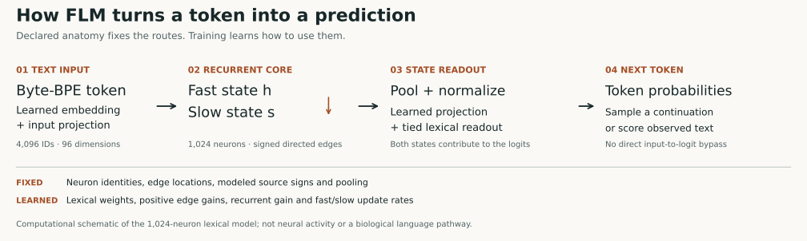
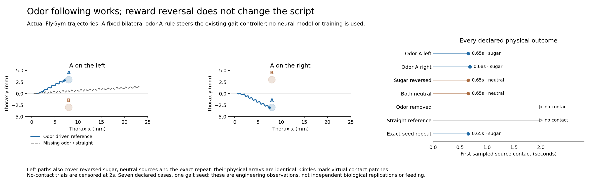
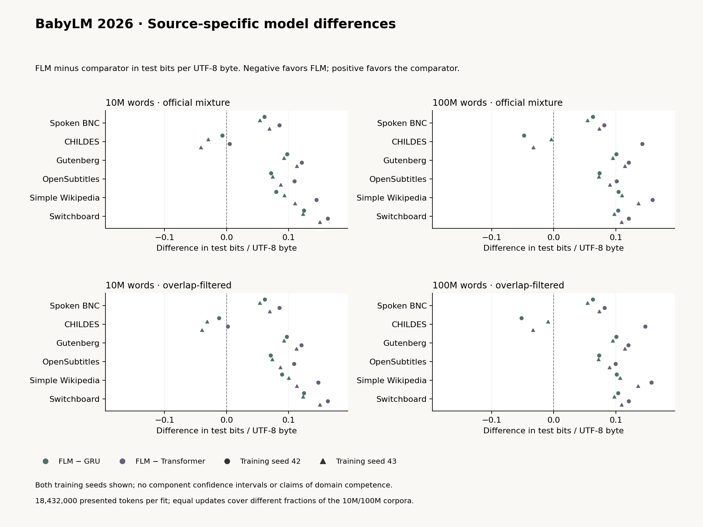
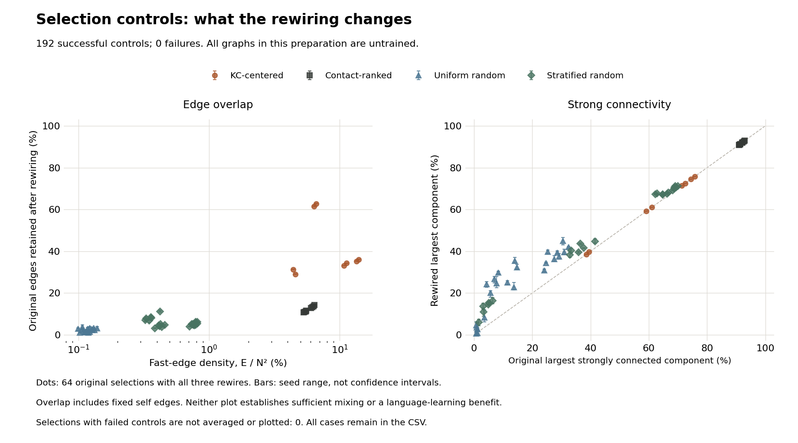

# FLM · Fly Language Model

**A language model whose recurrent wiring comes from a measured fruit-fly connectome.**

FLM learns next-token prediction **from scratch**, using a connectome-derived recurrent core and learned lexical input/output interfaces. **There is no pretrained or overfitted transformer attached to the fly visualization:** FLM itself produces the token probabilities and the neural state you see. The GRU and transformer are separately trained comparison models.

Built by **Kuber Mehta**, FLM makes the connection between wiring, memory and prediction inspectable: follow a token through the core, silence a neuron, change an output adapter, and compare the resulting predictions.

**[Open ChatFLM](https://flm.kuber.studio)** · [Explore the mechanisms](#what-language-training-changes) · [See the simulated fly](#additional-dynamics-and-behavior-studies) · [All benchmark findings](#completed-wiring-test) · [Papers](#papers-and-evidence) · [Run locally](#run-chatflm-locally)

[](https://flm.kuber.studio)

*Measured anatomical positions; the highlighted subset is not an activity recording. [Rendering provenance](public/brand/provenance.json).*

## How FLM predicts a token

A text token enters through a learned embedding and projection, updates **fast and slow recurrent state**, then passes through pooling and a tied lexical readout. The main lexical model contains **1,024 neurons, 76,130 directed edges and 600,003 trainable parameters**.



The edge locations and modeled signs stay fixed; training changes positive edge gains, recurrent gain, update rates and lexical weights. A transformer computes content-dependent attention over token representations. FLM instead compresses the preceding sequence into two evolving state vectors—**8 KiB in float32** for this core, excluding weights and temporary activations. Constant-size state is also a property of other recurrent models; it can forget information.

The specific research contribution is the combination of **declared anatomical wiring, trainable recurrent dynamics, controlled next-token experiments and inspectable inference**. It builds on [task-optimized connectome models](https://www.nature.com/articles/s41586-024-07939-3) and [fly-derived reservoir computing](https://arxiv.org/abs/2306.01885). The primary language models still learn by backpropagation. This is a compact computational model of a subset, not an intact biological brain or a large foundation model.

<details>
<summary>Update equations, memory accounting and comparison with attention</summary>

The schematic describes computation, not an anatomical language pathway. The implemented update is:

```text
drive      = input_projection(embedding[token]) + recurrent_gain · W · fast
fast_next  = (1 − alpha) · fast + alpha · tanh(drive)
slow_next  = (1 − beta) · slow + beta · fast_next
features   = normalize(concat(pool(fast_next), pool(slow_next)))
logits     = tied_lexical_readout(features)
```

| Design choice | FLM | Matched decoder transformer |
|---|---|---|
| Sequence computation | Repeated state updates through fixed edge locations | Content-dependent causal attention over token representations |
| Memory | Fast and slow state compress the preceding sequence | Cached keys and values retain representations within the implementation's context policy |
| Structural prior | Anatomical edge locations, modeled signs and declared pooling | Engineered attention and feed-forward layers |
| Primary learning | Next-token cross-entropy and truncated backpropagation | Next-token cross-entropy and backpropagation |

The difference is the computation and structural prior; the primary language experiment still uses gradient-based learning. The recurrent state occupies **8 KiB in float32**, independent of sequence length. A GRU also has constant-size recurrent memory. That count excludes weights, temporary activations and adapters, and the compressed state can forget information. The measured CPU implementation is slower than both baselines; sparse connectivity alone does not establish an energy advantage. See the [architecture specification](docs/ARCHITECTURE.md) and [runtime observations](public/research/runtime.json).

</details>

## Explore ChatFLM

- **Watch prediction happen.** Enter a prefix and inspect generated tokens, their probabilities and the actual fast/slow activity mapped to retained neurons in 3D.
- **Intervene in the computation.** Select and silence neurons or disable recurrence, then replay the same prefix from zero state. Restore the controls to compare predictions.
- **Adapt an output readout locally.** Supply learning text and a separate probe, compare before/after loss, and save, export or reset the checkpoint-specific adapter. This changes the output interface; it does not retrain the bundled recurrent core.
- **Inspect the body experiments.** Scrub recorded neural and physical states in the [Research view](https://flm.kuber.studio/#research), including wrong choices, controls and exact repeats.

Inference and local adaptation run in your browser, without an API key. Context or role-like text remains a prefix to a completion model, not a reliable system-instruction channel. The live body animation illustrates aggregate state; the recorded MuJoCo studies below use their own declared controllers. [Browser behavior and verification](docs/BROWSER-VALIDATION.md).

## What language training changes

**Learning changes the recurrent computation as well as the text interfaces.** In the completed two-seed WikiText controls, full FLM lowers test loss by **0.005797 BPB** against fixed dynamics and **0.006391** against no lateral recurrence. Removing all temporal state costs **0.124511 BPB**. A separate retrained no-slow comparison favors retaining slow state by **0.010999 BPB**.


*These are retrained mechanism comparisons in the declared setup; each panel has its own scale. Intervals condition on the fitted pairs. Unequal trainable/connected parameter counts limit the interpretation; mechanism benefits do not establish anatomical advantage.*

A separate pulse diagnostic shows how the learned core responds differently to the same input: its zero-drive fast-state spectral radius changes from **1.0207** initially to **0.9912 / 0.8722** after language training. Swapping learned edges and recurrent gain into the initial core largely reproduces that shift. This measures model dynamics, not a claim of greater intelligence, global stability or useful memory capacity. [Read the response study](docs/LANGUAGE-DYNAMICS-FINDINGS.md).

<details>
<summary>Every computation-control result, pulse figure and reproduction record</summary>

The [separate study](docs/LANGUAGE-CORE-PROTOCOL.md) completed six new fits at 6,000 updates each, with seeds 42/43. All eight selections, including the two full-FLM references, were frozen before new-control test scoring. The [complete report](reports/language-core/summary.json) retains every article and contrast.

| Contrast: first minus second | Seed 42: Δ BPB | Seed 43: Δ BPB |
|---|---:|---:|
| Full − fixed dynamics | −0.005663 | −0.005931 |
| Full − no lateral recurrence | −0.006230 | −0.006551 |
| Full − no temporal state | −0.125647 | −0.123375 |
| No lateral − no temporal state (secondary) | −0.119416 | −0.116824 |

Negative favors the first model. All eight 95% paired-article intervals lie below zero, conditional on each fitted pair; shared references and two seeds do not establish general training uncertainty. The secondary mean of **−0.118120 BPB** favors retaining independent temporal units when graph communication is absent. This exploratory study does not cross topology with trainability, so it cannot establish an anatomical advantage.

[Fixed dynamics](docs/LANGUAGE-CORE-CONTROLS.md) freezes 78,179 recurrent parameters and trains 521,824 lexical-interface parameters through time. It is not a readout-only reservoir or matched in trainable parameter count. No lateral recurrence retains fast/slow memory; no temporal state resets both states per token. Both allocate 600,003 entries marked trainable but disconnect 76,131 edge/gain entries from the objective. These counts are not effective-capacity estimates. The [separate harness](flm/language_core_study.py) passed fixture tests and exact single-thread/bounded four-thread reference checks.

The [score-record archive](https://flm.kuber.studio/research/language-core-records.zip) passed [fresh NumPy arithmetic verification](reports/language-core/records-release.json) outside the repository, with FLM and PyTorch imports disabled. The [eight-model inference bundle](https://flm.kuber.studio/research/language-core-inference.zip) has [32 unedited continuations](public/research/language-core-samples.json); its [fresh CLI audit](public/research/language-core-inference-release.json) reproduced one reference prompt per model outside the repository. These checks do not independently retrain models or rescore held-out text.

### Recurrent responses to a synthetic pulse

The [pulse diagnostic](docs/LANGUAGE-DYNAMICS-PROTOCOL.md) compares seven recurrent-core conditions from the two completed WikiText FLM references: one shared initialization, two trained cores and four acute parameter swaps. Eight fixed synthetic directions at amplitudes 0.001 and 1.0 are followed by 256 zero-drive updates, bypassing the normal lexical interface. The zero-state fast spectral radius changes from **1.0207** initially to **0.9912 / 0.8722** after training. Edges/gain-only swaps closely reproduce that shift; time-constants-only swaps remain above one. [All seven conditions replay exactly](reports/language-dynamics/replay.json) in the recorded environment; no new fitting or corpus tokens are used. These local and finite-horizon observations establish neither global stability, memory capacity, improved language accuracy nor behavioral transfer. See [findings and limits](docs/LANGUAGE-DYNAMICS-FINDINGS.md).


</details>

## Additional dynamics and behavior studies

**A learned sensory decision can drive a simulated fly through an engineered motor interface.** Separate sensory cores learn delayed cue rules, reversal and context. Their decisions control a calibrated turn signal; FlyGym's designed gait and contact controller supplies leg motion. These are experiments in memory, learning and feedback, not language-trained motor behavior.

[](https://flm.kuber.studio/research/closed-loop.mp4)

*Actual MuJoCo output from the predeclared eligibility/live/switch condition. Two simulated seconds play in eight seconds. The waypoint is a virtual coordinate and is not drawn as a physical object in this camera.*

| Experiment | What the completed study shows |
|---|---|
| [60 cue/context runs](docs/WIRING-RESULTS.md) | Memory and wiring effects depend on the task: measured wiring wins some panels, rewired controls win others. |
| [27 pose-feedback conditions + repeat](docs/CLOSED-LOOP-REPRODUCTION.md) | Current body feedback changes the path; all three trained controllers match the scripted reference's physical paths. |
| [24 initial/language-trained food references](docs/FOOD-CORE-PHYSICAL-RESULTS.md) | The interfaces produce audited body/neural rollouts, while retaining wrong-source contacts and timeouts. No food adaptation or language-transfer benefit is demonstrated. |

The [interactive replay](https://flm.kuber.studio/#research) keeps these distinctions visible: learned sensory choice, designed gait, unadapted food reference and decorative language-linked animation are different mechanisms. No model here has learned a gait or feeding behavior from language.

<details>
<summary>Learning curves, pose-feedback results, food references and replay records</summary>

### Memory, reversal and learning rules

A separate 256-neuron, 6,678-edge core learns a delayed cue rule that reverses and then returns. The 60-run extension adds a context-dependent task and signed, degree-preserving rewired controls. It compares full backpropagation through time (BPTT), a fixed recurrent core with trained readout, supervised forward eligibility, a no-history approximation and reward-modulated eligibility.


*Markers show three-seed means; whiskers show observed seed minima and maxima, not confidence intervals. The dotted line marks 50% chance accuracy. This is one declared diagnostic panel; [all delays, seeds and checkpoints are retained](public/research/wiring-learning.json).*

The long-delay cue panel favors measured wiring under BPTT: **100.00% versus 66.67%**. The delay-8 context panel reverses that ordering: **63.02% versus 76.04%**. Supervised eligibility also does not consistently improve on a fixed core or no-history control. These are simple artificial tasks, and three seeds cannot support a universal ranking. The [findings](docs/WIRING-RESULTS.md), [protocol](docs/WIRING-LEARNING-PROTOCOL.md) and [complete records](https://flm.kuber.studio/research/wiring-learning-records.zip) include prediction panels and exact-versus-approximate gradient diagnostics.

Separate [language-rule input preparation](docs/LANGUAGE-LEARNING-INPUTS.md) binds six BabyLM `train-10m` sources: **3,351 blocks, 54,399,840 UTF-8 bytes and 18,591,514 text tokens**, excluding inserted boundaries. BPTT, fixed core, forward eligibility and no-history eligibility share initial tensors within each seed (42/43) on the original 1,024-neuron graph. All eight preparations passed two tiny synthetic updates; fixed-core parameters stayed unchanged. Unlike the completed fixed-dynamics control, this rule also freezes the input projection. The [cost-pilot](docs/LANGUAGE-LEARNING-TIMING.md) and [per-run selection](docs/LANGUAGE-LEARNING-VALIDATION.md) input preflights cover eight full-window declarations and 48 validation prefixes (49,152 text targets), without model scoring or updates. An [eight-condition coordinator](docs/LANGUAGE-LEARNING-STUDY.md) implements immutable pre-fit identity, serial/resumable fitting and whole-inventory selection gates. **No official alternative-learning protocol, cost pilot, identity, fits, selections or test scores exist yet**: this study still needs its own cost pilot and registration; the [held-out scorer](docs/LANGUAGE-LEARNING-TEST.md) is implemented but has not run on the official study.

### A body that responds to current pose

The completed online feedback assay crosses four fixed sensory checkpoints with live or frozen pose in three waypoint scenarios, then adds a scripted reference: **27 conditions and one exact repeat**. Ground-truth body pose becomes an engineered cue. A delayed neural decision controls a calibrated two-value turning interface; FlyGym's designed gait and contact feedback handle the legs.


*The target switches at one simulated second. The three trained controllers and scripted reference overlap because their recorded physical paths are identical. The right panel compares live and frozen pose for the eligibility controller.*

| Scenario | Trained controllers, live pose | Same controllers, frozen pose |
|---|---:|---:|
| Positive waypoint | 7.68° | 96.41° |
| Negative waypoint | 7.26° | 93.91° |
| Switching waypoint | 16.27° | 100.50° |

Values are time-mean absolute target-bearing error; lower is better. Each trained method gives the same values in a scenario. Across all conditions there are **seven distinct body paths**. This establishes a working sensory-to-body interface, while the fixed-core and scripted matches show that these tasks do not establish a need for learned recurrent dynamics. One model seed and one physics seed do not support population intervals.

The complete audit independently replays **10,800 control frames and 972 delayed decisions**, plus the separate repeat. The three scripted cases have no invented neural states. The [45.9 MB standalone archive](https://flm.kuber.studio/research/closed-loop-records.zip) includes controllers, parity fixtures, trajectories, source and licenses; its audit works without FlyGym or repository access. See [reproduction instructions](docs/CLOSED-LOOP-REPRODUCTION.md) and the [four-page report](public/research/closed-loop.pdf).

The language weights are not used in this assay, and no motor learning occurs during it.

The [Research view's before/after replay](https://flm.kuber.studio/#research) revisits the earlier [40 sensory-choice trials](public/research/learned-choice.json): five methods, both cues and checkpoints 0/300/600/900 from seed 17. A time scrubber shows recorded position and yaw on two exactly repeated physical paths, retaining wrong choices. Decisions precede simulation; this is a view of existing evidence, not new fitting, food sensing or language-to-action transfer. Inspect the [replay frames and checkpoint identities](public/research/choice-replay.json). The separate [six-channel food-sensor interface](docs/FOOD-SENSOR-INTERFACE.md) was checked on repeated 0.02-second prescribed FlyGym motion and scalar sensor replay.

A [declared scripted odor-A reference](docs/FOOD-APPROACH-REFERENCE.md) then completed all seven physical cases, retaining reversal, neutral, missing-odor and straight controls plus the exact repeat. The [findings](docs/FOOD-APPROACH-RESULTS.md) and [complete records](https://flm.kuber.studio/research/food-approach-records.zip) include a scalar replay of **1,407 observations**. No neural learning, feeding or language transfer is involved.



*First sampled A contact: 0.65 s on the left, 0.68 s when mirrored. Reversal and neutral cases still contact A at 0.65 s without sugar; missing odor and straight drive make no contact by 2 s. The repeat matches the original physical arrays exactly.*

Four [initial and WikiText-trained core interfaces](docs/FOOD-CORE-INTERFACE.md) completed a separate [24-case physical reference](docs/FOOD-CORE-PHYSICAL-RESULTS.md): two core seeds, six conditions and identical fresh adapters, with **zero food-task updates**. The [complete archive](https://flm.kuber.studio/research/food-core-physical-records.zip) passed numerical replay of all **4,824 observations**. The [browser replay](https://flm.kuber.studio/#research) exposes every condition with saved neural states and body geometry reconstructed from recorded coordinates.


*All four cores contact the upper patch even when odor A is on the right. Language seed 43 also contacts sugar with odor removed; the other three time out. These outcomes establish neither food learning, feeding nor beneficial transfer.*

The [physical-state note](docs/PHYSICAL-STATE-SEMANTICS.md) documents the invalid `c_head` row aliasing `rh_tarsus5`; replay geometry avoids that row. Food sensing and outcomes use correctly resolved antenna, foot and thorax IDs, with cached sensor poses distinguished from reconstructed display geometry.

The [sampled-action episode runner](docs/FOOD-EPISODE-RUNNER.md) passes eight 20-ms connection checks and four exact physical restart comparisons with learning disabled; interrupted attempts restart from original inputs, not live simulator/gait checkpoints, with no navigation or transfer benefit established and [official adaptation pending](docs/FOOD-ADAPTATION-SCHEDULE.md).

ChatFLM's interactive body animation is also separate: it illustrates aggregate language-model state through authentic articulated geometry. It is not the physics study or a learned gait. The body and brain derive from different-sex specimens.

</details>

## Completed wiring test

**No anatomical language advantage was demonstrated for this selected subset and setup.** All six measured-minus-rewired test effects are positive: mean **+0.001559 BPB**, range **+0.000911 to +0.002809**. The implemented slow-state branch helps against retrained no-slow models: mean **−0.010999 BPB**.


*Differences are measured fast/slow FLM minus the control; negative favors measured fast/slow. Lines show 95% paired-article bootstrap intervals, conditional on each fitted pair.*

Three of six topology intervals include zero. The three graphs × two training seeds share two measured references; these are not six independent replications. This exploratory extension follows inspection of the original test scores. This ranked-subset result does not test biological topology in general or estimate a topology-by-slow-state interaction.

All ten [checkpoint selections](reports/language-topology/selection.json) were frozen before new control test scoring, after 6,000 updates per run. Every run was scored on all 60 test articles. Inspect the [complete scores](public/research/language-topology-results.json), [records archive](https://flm.kuber.studio/research/language-topology-records.zip) and [release audit](reports/language-topology/records-release.json).

<details>
<summary>All paired wiring effects, graph matching and parameter limits</summary>

| Control | Training seed 42: Δ BPB | Training seed 43: Δ BPB |
|---|---:|---:|
| Rewired graph 101 | +0.001830 | +0.001523 |
| Rewired graph 103 | +0.000981 | +0.002809 |
| Rewired graph 107 | +0.000911 | +0.001298 |
| Retrained no-slow state | −0.011836 | −0.010163 |


*Orange and green denote modeled edge signs; blank entries have no edge. These are graph matrices, not neural activity. Every panel contains 1,024 neurons and 76,130 edges.*

The [language topology study](docs/LANGUAGE-TOPOLOGY-PROTOCOL.md) held the rest of the language machinery fixed and trained three independently rewired graphs with both original initialization seeds. Directed degrees, source-sign constraints, incoming signed weights, self edges, node identities and pooling were preserved. The [structural audit](docs/LANGUAGE-STRUCTURE.md) reports what changes, including reciprocity and edge overlap. These finite rewiring chains do not preserve every graph property or prove uniform sampling.

The eight new fits comprise six rewired models and two retrained no-slow models, alongside two reused measured references. Every model allocates 600,003 parameter entries. The no-slow variant disconnects its 1,024 beta entries from the objective; normalization can still make nominal slow-feature readout columns nonzero. Allocated parameters therefore do not establish equal effective capacity. This tests the implemented slow-state branch, not all memory alternatives. See the [frozen protocol](docs/LANGUAGE-TOPOLOGY-PROTOCOL.md).

</details>

## Language results

**FLM trails both approximately matched neural baselines on pooled BabyLM and WikiText loss.** Lower test bits per byte (BPB) is better. BabyLM adds six spoken/written components, two training-data sizes and a shared tokenizer fitted on 10M text.


*Circles and triangles are training seeds 42/43; diamonds are their means. No uncertainty interval is shown.*

| Training pool | Test subset | FLM mean BPB | GRU mean BPB | Transformer mean BPB |
|---|---|---:|---:|---:|
| 10M | Official | 1.947712 | 1.893743 | 1.874470 |
| 10M | Overlap-filtered | 1.966842 | 1.903578 | 1.882700 |
| 100M | Official | 1.897191 | 1.841673 | 1.801002 |
| 100M | Overlap-filtered | 1.925800 | 1.862178 | 1.825476 |

Each of twelve fits completed 12,000 updates and **18,432,000 input-token presentations**. This is fixed sampled exposure, **not a full epoch of 100M text or equal runtime**. The official test covers 3,187 blocks and 51,722,871 target bytes; the fixed overlap filter retains 2,528 blocks and 40,963,714 bytes. These are the project's declared compact comparisons, not official BabyLM Challenge leaderboard scores.

CHILDES is the only component where FLM's two-seed mean beats a baseline: both baselines at 10M, GRU alone at 100M, in both analyses. Its transformer contrasts change sign across seeds. All sixteen pooled paired-block intervals favor the baselines, conditional on these checkpoints and component block counts; unknown document dependence and two seeds limit inference. No completed BabyLM topology comparison exists yet.

All [288 unedited continuations](reports/babylm/samples.json) reached the 256-token cap; one invalid UTF-8 continuation is retained. FLM has more repetition in the aggregate token measures. These models have not demonstrated reliable chatbot ability. Read the [complete findings, component scores and limits](docs/BABYLM-FINDINGS.md), including the [preserved serialization failure and fresh restart](docs/BABYLM-HANDOFF.md#evaluation-recovery).

<details>
<summary>BabyLM component differences and recorded uncertainty</summary>



The [168 score rows](reports/babylm/tables-v1/scores.csv) retain every seed, component and analysis; [seed means/SDs](reports/babylm/tables-v1/seed_aggregates.csv) and [paired intervals](reports/babylm/tables-v1/paired_comparisons.csv) remain separate. Component differences are descriptive, without component-level confidence intervals. Filtering removes whole blocks with substantial exact normalized-line matches, changes the mixture and does not establish contamination-free evaluation.

</details>

<details>
<summary>Earlier completed WikiText comparison</summary>

**FLM trails both matched neural baselines on the completed WikiText comparison.** Lower test bits per byte (BPB) is better.


*Each circle or square is one training seed; diamonds are two-seed means. No uncertainty interval is shown. This [generated figure](docs/figures/readme_figures.py) reads the [published test report](public/research/test-results.json) directly.*

| Model | Parameters | Seed 42 test BPB | Seed 43 test BPB | Mean test BPB |
|---|---:|---:|---:|---:|
| FLM | 600,003 | 1.9732 | 1.9756 | **1.9744** |
| GRU | 595,408 | 1.9045 | 1.9052 | **1.9049** |
| Transformer | 607,468 | 1.8770 | 1.8764 | **1.8767** |

All six runs share the official article partitions, tokenizer and 6,000-update budget. Within each seed, the three architectures receive identical sampled training windows. Each run receives 9,216,000 input-token presentations. The final score covers all 60 test articles and 1,287,656 target bytes. BPB measures next-token codelength divided by exact UTF-8 target bytes; it is not the word-token perplexity often quoted for WikiText.

The [article scores and paired intervals](public/research/test-results.json) are conditional on these fitted checkpoints. [Fixed-prompt continuations](public/research/samples-index.json), [grammar diagnostics](public/research/grammar-results.json) and [inference costs](public/research/runtime.json) accompany the comparison; attractive samples are not the selection criterion.

</details>

## Current selection study

The first wiring test used a connectivity-ranked subset with no KC-prefix cells. The next question is whether a different selection rule helps: **operational KC-centered candidates versus contact ranking and matched random selections**, with rewiring tested separately within every selected node set.

The [registered study](docs/SELECTION-LANGUAGE-PROTOCOL.md) is running **128 fits** across `KCg-d-L-t5` and `KCg-d-R-t5`, at **3,000 updates per fit**. Each side includes the candidate, ranked and random controls, three rewires and both training seeds. The [64-graph cost pilot](reports/selection-pilot/timing.json) informed the frozen budget. All fits must finish before validation selection and the all-condition test gate; **results remain pending**.

These 487/540-neuron operational selections retain 81–85% of seed-KC raw contacts but cut about 89% of whole-subset incoming contacts. They are not intact functional circuits. Matching nodes or annotations does not match edge density or parameter allocation; this 4,608,000-token screen is not an equal-exposure replacement for the 18,432,000-token BabyLM baseline. [Frozen identity](reports/selection-language/study-identity.json) · [Protocol wording correction](docs/SELECTION-LANGUAGE-ERRATA.md) · [Continuing plan](docs/PLAN.md).

<details>
<summary>Original subset audit, current candidates and all structural controls</summary>

The [subset audit](docs/SUBSET-AUDIT.md) reproduces the selection: rank 32,164 `cb_intrinsic` neurons by incoming-plus-outgoing raw contacts within that eligible population, break ties by body ID, and retain 1,024. This is an anatomical eligibility rule and connectivity ranking with a computational size limit, **not an intact circuit**. The subset contains **0.61% of the 166,700 acquired neurons**.

The boundary cuts **79.42% of incoming and 73.96% of outgoing raw contacts**, using different denominators; these fractions do not measure lost functional current. A separate source-sign filter removes 12,327 internal connections, leaving 76,130. Literal labels include zero of 4,064 `KC`-prefix neurons, 48 of 97 `MBON`-prefix neurons and six of 50 `EPG`-prefix neurons; those counts do not certify circuit membership. See the [audit records](reports/subset-audit/summary.json) and [graph provenance](data/graphs/central-1024/graph-card.json).

The core is a differentiable rate network. Contact counts and neurotransmitter annotations inform versioned modeling choices, rather than recovering measured synaptic strengths or pretrained knowledge.

The recorded graph commit precedes the first trainer, with no recorded performance-based subset search. This documents the tracked procedure; it does not prove what unrecorded design choices occurred. The [subset audit](docs/SUBSET-AUDIT.md) retains the history and exact source replay.


The named family inventories retain more internal raw contacts but use different numbers of neurons and edges. This is not a matched performance comparison. All 316 PAM and 16 PPL1 cells have fast sign zero in the acquired runtime: selecting them alone would not restore their outgoing modulatory pathways. The [complete records](reports/selection-feasibility/summary.json), [candidate body IDs](reports/selection-feasibility/candidate-body-ids.json) and [planned controls](docs/SELECTION-STUDY.md) keep selection, dynamics and learning-rule questions distinct.

The [publisher reconciliation](docs/PUBLISHER-ANNOTATIONS.md) verifies every runtime type and superclass against curated body annotations. Transmitter consensus matches all 166,522 bodies with records; 178 missing records stay explicit. Its 5,293-row candidate export adds ALPN-class upstream candidates and richer instance labels, without claiming that a functional subcircuit has been established.

The [pathway audit](docs/SELECTION-PATHWAYS.md) measures the full acquired graph: **314 of 686 ALPNs** have contacts to **3,812 of 4,064 KCs**, totaling 390,928 ALPN→KC contacts. **3,811 KCs** have both ALPN input and MBON output at ≥1 contact per directed pair; **3,726** do at ≥5. Applying the current fast-sign rule would drop all **262,661 PAM/PPL1→KC/MBON contacts**. Missing ALPN input does not establish missing sensory input. These body-pair counts certify neither functional signal transmission nor learning.


The [operational KC-centered rules](docs/CIRCUIT-SELECTION.md) define eight candidates (`KCg-d`/`KCg-m` × L/R × membership thresholds 1/5), each with seven comparison selections: **64 untrained inventories**. At threshold 5, the 487/540-cell `KCg-d` candidates retain about **81–85% of seed-KC incoming/outgoing raw contacts**, yet cut about **89% of whole-subset incoming contacts**; the 1,150/1,202-cell `KCg-m` candidates retain over **96% of seed-KC contacts**. Comparators share a 134,491-cell, six-superclass pool broader than the historical central-only eligibility. Uniform and superclass/side/sign-stratified controls remain much sparser, so these are not topology results. The rules are operational hypotheses, not certified circuits.

The [graph archive](https://flm.kuber.studio/research/selection-graphs.zip) and [export note](docs/SELECTION-GRAPH-EXPORTS.md) provide all 64 untrained graphs, without trained weights or a tokenizer. Under the declared interface, they span **487–1,385 neurons and 470,945–766,693 allocated parameters**. The exporter exactly reproduces all nine frozen-reference arrays. The earlier [timing preparation](docs/SELECTION-TIMING-PILOT.md) verified two synthetic-token updates per full-size graph through the shared BPTT/AdamW function (batch 1, three tokens, one CPU thread). The [completed corpus cost pilot](reports/selection-pilot/timing.json) now measures all 64 original graphs with three warmup and twelve timed updates each. This is short-run cost evidence, with no selection-language quality scores; rewires were not timed.

**All 192 structural controls completed, with zero failures.** The [complete archive](https://flm.kuber.studio/research/selection-rewiring.zip) contains 64 originals and 192 rewires, all untrained. The [results note](docs/SELECTION-REWIRING-RESULTS.md) and [standalone audit](reports/selection-rewiring/standalone-audit.json) document the verified graph constraints. A [language-training adapter](docs/SELECTION-LANGUAGE-TRAINING.md) binds these graphs to fresh models and shared BPTT fit/resume. The [coordinator](docs/SELECTION-LANGUAGE-COORDINATOR.md) requires all eight selections per candidate, each measured plus three rewires at seeds 42/43: **64 fits per chosen group**. The [held-out scorer](docs/SELECTION-LANGUAGE-TEST.md) requires all registered fits and selections before test access, retaining family means and individual selection/topology contrasts. The [frozen study identity](reports/selection-language/study-identity.json) registers `KCg-d-L-t5` and `KCg-d-R-t5` (487/540 neurons): **128 fits at 3,000 updates each**. Training has started. All fits must finish before validation selection and the all-condition test gate. This limited-exposure screen uses 4,608,000 input-token presentations per fit, not the completed BabyLM baseline's 18,432,000; no convergence or equal-budget superiority claim follows.



*Each point is one original selection: mean and full range over three graph seeds, not a confidence interval. Panels show original-edge overlap and largest strongly connected components before/after rewiring.*

Original-edge overlap spans **28.96–62.87%** for KC-centered selections, **10.74–14.45%** for contact-ranked, **0.81–4.72%** for uniform and **3.01–11.70%** for stratified. Their degree/sign constraints differ, so overlap is not a calibrated mixing score. These structural diagnostics establish no language benefit or biological function.

</details>

## Data and deferred work

| Corpus | Role and handling |
|---|---|
| **WikiText-2 raw** | Completed comparison: 600 training articles, 2.05 million words; official 600/60/60 partitions and a train-only vocabulary. |
| **BabyLM 2026** | Six spoken/written components at 10M/100M word budgets. Completed [12-fit held-out comparison](docs/BABYLM-FINDINGS.md) and 288 fixed continuations; shared 10M-fitted tokenizer and overlap audit. |
| **AMI Meeting Corpus** | Earlier dialogue model; manual transcripts with participant-disjoint splits. |
| **SCAN** | Prepared command-composition benchmark with a [36-condition coordinator and terminal-checkpoint gate](docs/SCAN-STUDY-COORDINATOR.md) and [implemented whole-partition scorer](docs/SCAN-EVALUATION.md). Official timing, protocol, budget, fits and results remain pending. |

Training uses text, without pretrained embeddings, synthetic teacher corpora or private conversations. [Dataset cards](data/cards/) record revisions, hashes and transformations; raw corpora stay local. See [BabyLM's protocol](docs/BABYLM-PROTOCOL.md), [evaluation declaration](docs/BABYLM-EVALUATION.md), [acquisition status](docs/DATA-STATUS.md) and [SCAN's data audit](docs/INSTRUCTION-TRANSFER.md).

## Use ChatFLM

**Chat on the left; real FLM state above a 3D typing fly on the right.** Light and dark themes, saved conversations, an optional system prompt and exact-input inspection keep the everyday workspace simple. Advanced neuron interventions and prediction details open when you need them. The typing motion is a designed illustration.

The automatic default is **BabyLM 100M FLM, seed 43**, chosen by the lowest shared BabyLM validation loss among released FLM checkpoints. All **18 primary neural checkpoints** and the earlier AMI model are in the selector. GRU/transformer selections are explicitly labeled and have no anatomical activity display.

Chat stores and feeds back real turns; these base models have **no instruction tuning**, so role formatting does not guarantee helpful answers. Continue-text mode remains available. See [model selection, system context, stopping rules and browser verification](docs/CHATFLM.md).

## Run ChatFLM locally

Requires **Node.js 22.12 or newer**. Browser checkpoints, tokenizer and attributed anatomical/body assets are included. No hosted inference API or key is required.

```sh
npm ci --ignore-scripts
npm run dev -- --port 5180
```

<details>
<summary>Production preview, deployment and browser adaptation</summary>

Open the URL printed by Vite. For a production build:

```sh
npm run build
node node_modules/vite/bin/vite.js preview --host 127.0.0.1 --port 5181 --strictPort
```

GitHub Actions publishes `dist/` to Pages, with `public/CNAME` pointing to `flm.kuber.studio`. The repository remains private while the generated website and standalone release archives are public.

Text inference runs in a CPU worker; optional 3D views require WebGL. Conversations and adaptation stay in the browser. A separate output adapter can be reset, saved and exported; it does not modify the bundled checkpoint and is bound to a checkpoint hash. Save session learning before switching models. Adapter changes cannot alter recurrent activity for a fixed input sequence, though they can change generated tokens and therefore later activity. These browser updates are distinct from training the language core or the sensory networks.

A 3D fly types on a keyboard beside the composer during streamed generation, using the same articulated NeuroMechFly meshes as the body view. Its front legs press the keys while four support feet stay planted. Animation follows generation and Stop automatically, pauses offscreen, and respects reduced-motion preferences. This is an authored illustration, separate from inference state and physical recordings.

</details>

## Try FLM, GRU and transformer

The [six-model inference bundle](https://flm.kuber.studio/research/wikitext2-inference.zip) includes both published training seeds for each architecture, their shared tokenizer, the measured graph and a standalone Python runtime. It works without this repository or the training corpus. Follow the [public installation guide](https://flm.kuber.studio/research/inference-guide.html), then run inside the extracted bundle:

```sh
python -X utf8 -m flm.inference --model flm --prompt "The history of science"
python -X utf8 -m flm.inference --model gru --prompt "The history of science"
python -X utf8 -m flm.inference --model transformer --prompt "The history of science"
```

The [release record](public/research/inference-release.json) identifies all original selected checkpoints and the archive's SHA-256. Exported tensors and fixed buffers match their sources; all 24 published continuations replay under the tested CPU environment. The browser selector also runs all 18 completed primary FLM, GRU and transformer checkpoints, plus the earlier AMI model. See [runtime and sampling details](docs/INFERENCE-BUNDLE.md).

The separate [ten-model topology inference bundle](https://flm.kuber.studio/research/language-topology-inference.zip) contains two measured references, six rewired checkpoints and two retrained no-slow checkpoints. All ten model CLIs reproduced their reference continuation from a fresh extraction. The [release record](https://flm.kuber.studio/research/language-topology-inference-release.json) also verifies every exported tensor/buffer and all [40 fixed-prompt continuations](https://flm.kuber.studio/research/language-topology-samples.json) against their sources. The six-model FLM/GRU/transformer bundle above remains separate.

## Papers and evidence

All five papers are working reports for the continuing program. They include limitations and reproduction boundaries; they are not claims of peer review.

| Report | What it covers |
|---|---|
| [FLM methods and language results](public/research/flm.pdf) | Recurrent equations, completed WikiText baseline, topology and computation controls, inference costs and acute interventions |
| [Data and reproduction](public/research/data-and-reproduction.pdf) | Sources, transformations, tokenizer/split integrity and BabyLM preparation |
| [Local learning and physical choices](public/research/local-learning.pdf) | Fifteen learning-rule runs and forty precomputed-choice physical replays |
| [Wiring, context and learning controls](public/research/wiring-controls.pdf) | Complete 60-run study, rewired graphs and gradient diagnostics |
| [Online physical feedback](public/research/closed-loop.pdf) | Every pose-feedback condition, scripted references and exact repeat |

The [public LaTeX source archive](https://flm.kuber.studio/research/paper-source.zip) contains sources, generated tables and figures. [Build instructions](papers/README.md) describe the toolchain. [Research consolidation](docs/RESEARCH.md) connects the work to primary connectomics, recurrent-model and eligibility-trace literature; [the continuing program](docs/RESEARCH-PROGRAM.md) separates completed evidence from proposed experiments.

## Reproduce and verify

The [matched language protocol](docs/WIKITEXT-PROTOCOL.md) and [topology operations guide](docs/LANGUAGE-TOPOLOGY-OPERATIONS.md) describe the completed studies and their reproduction. Preserve frozen inputs and completed observations; run only one writer per output directory. Training and full evaluation can take many hours on a laptop.

<details>
<summary>Training commands, acquisition, study entry points and physics environments</summary>

The language environment requires Python 3.10 or newer; measured runs use PyTorch 2.8.0 on CPU. Raw corpora and training intermediates are ignored by Git. Training and full evaluation can take many hours on a laptop. Use separate output directories for different protocols, and never launch a second writer against an active run.

```sh
python -m pip install -e ".[language]"
python -m flm.wikitext
python -m flm.tokenizer
python -m flm.language_suite
```

Acquisition verifies pinned revisions, sizes and SHA-256 hashes. Article grouping preserves original text and official partitions. The vocabulary is fitted only on training text, then frozen for validation/test encoding. Completed runs are verified before reuse; stopped runs resume with optimizer, random-state and sampled-exposure records. The tracked compact graph is sufficient for training.

| Study or artifact | Entry point and instructions |
|---|---|
| WikiText training, scoring and export | [Matched protocol](docs/WIKITEXT-PROTOCOL.md), [inference/export guide](docs/INFERENCE-BUNDLE.md) |
| Anatomical graph reconstruction | `python -m flm.acquire_graph`, then `python -m flm.graph --source data/processed/connectome --output work/reproduced-graph` |
| Language topology and slow-state controls | [Frozen protocol](docs/LANGUAGE-TOPOLOGY-PROTOCOL.md), [scheduler and recovery](docs/LANGUAGE-TOPOLOGY-OPERATIONS.md) |
| Retrained language computation controls | [Frozen protocol](docs/LANGUAGE-CORE-PROTOCOL.md), [findings and parameter limits](docs/LANGUAGE-CORE-RESULTS.md) |
| Completed BabyLM comparison and 288 continuations | [Findings](docs/BABYLM-FINDINGS.md), [training protocol](docs/BABYLM-PROTOCOL.md), [evaluation declaration](docs/BABYLM-EVALUATION.md) |
| Learning-rule and topology diagnostics | [Original learning protocol](docs/LOCAL-LEARNING-PROTOCOL.md), [60-run extension](docs/WIRING-LEARNING-PROTOCOL.md) |
| Language eligibility implementation, not fitted results | [Complete window-gradient kernel and numerical checks](docs/LANGUAGE-ELIGIBILITY-KERNEL.md) |
| Recorded feedback audit or fresh MuJoCo simulation | [Standalone instructions](docs/CLOSED-LOOP-REPRODUCTION.md), [physical environment](experiments/embodiment/README.md) |
| Papers and README comparison figure | [Paper builds](papers/README.md), `python docs/figures/readme_figures.py` |

Physical simulation uses its own Python 3.12 environment and [pinned dependencies](requirements-embodied-lock.txt). Auditing released trajectories requires only NumPy and the included source; rerunning the physics requires FlyGym/MuJoCo. Keep a new simulation's identity and observations separate from downloaded records.

</details>

<details>
<summary>Verification commands and repository layout</summary>

```sh
python -m unittest discover -s tests -p "test_*.py"
npm test
npm run build
```

Checks cover causal streaming, graph constraints, exact resumed updates, byte accounting, tokenizer/export parity, browser adaptation, worker cancellation and physical sensory-to-command causality. [Browser validation](docs/BROWSER-VALIDATION.md) and the release reports record observed environments and limitations. Passing an implementation check does not establish a model-quality or biology claim.

| Location | Contents |
|---|---|
| `flm/` | Acquisition, graph selection, models, training, export and reporting |
| `web/` | Browser inference worker, adaptation, interface and 3D views |
| `data/cards/`, `data/tokenizers/`, `data/graphs/` | Versioned provenance, vocabularies and compact graphs |
| `experiments/embodiment/` | Calibrated physics, sensory controller and independent replay verifier |
| `reports/`, `public/research/` | Machine-readable studies, figures, papers and release archives |
| `docs/`, `papers/`, `tests/` | Protocols, research decisions, LaTeX sources and verification |
| `runs/`, `data/raw/`, `data/processed/` | Local, untracked training and corpus intermediates |

</details>

The registered BabyLM comparison and selection cost pilot are complete, and the controlled selection study is running. Larger-data, capacity-scaling and language-to-action research remain open. Contributions should preserve provenance, retain unsuccessful runs and add meaningful checks for changed behavior. Work is recorded in sequential, descriptive commits.

Original implementation: **MIT**. Imported components retain their licenses. Brain data and AMI transcripts use CC BY 4.0; WikiText publisher metadata lists CC BY-SA 3.0 and GFDL while its prose links another license version, a discrepancy preserved in the dataset card. Raw corpus text is not redistributed. See [component notices](licenses/) and the [public attribution page](https://flm.kuber.studio/licenses/).
