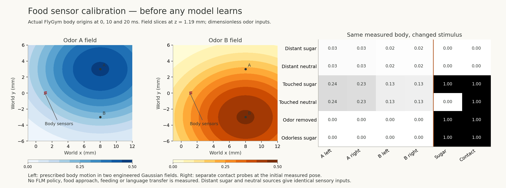

# Food sensing: a calibrated interface before learning

Kuber Mehta · 11 September 2026. This implements the sensory part of the
[food-response plan](FOOD-RESPONSE-PLAN.md). **No FLM policy, language weights,
food-task adaptation, learned approach or feeding response is tested here.**
The active BabyLM, selection, learning-rule and existing body studies retain
their separate identities and controls.



The [current physical record](../reports/food-sensors/visible-odor-probe.json)
contains actual FlyGym body positions, generalized coordinates and all sensor
observations. The [scalar audit](../reports/food-sensors/visible-odor-audit.json)
recomputes the observations without importing NumPy, FLM or FlyGym.
[Figure values](../public/research/figures/food-sensors.csv) are available separately.

## Six explicit channels

The [sensor module](../flm/food_sensors.py) exposes exactly these inputs:

| Channels | Measured quantity | Units / range |
|---|---|---|
| Odor A, left and right | Field A at the two antenna body origins | Dimensionless, [0, 1) mathematically |
| Odor B, left and right | Field B at the same two origins | Dimensionless, [0, 1) mathematically |
| Sugar contact | Largest sugar intensity among touched source volumes | Dimensionless, [0, 1] |
| Source contact | Whether any sampled foot origin lies in a source volume | 0 or 1 |

For a source centered at `p` with axis-aligned spread `sigma` and channel
amplitude `a`, the raw odor is
`a * exp(-0.5 * sum(((x - p) / sigma)**2))`. Sources superpose independently.
The observation transform is the fixed `c / (1 + c)`, with no normalization by
the current scene, closest source or rewarded source. Finite precision can round
very large transformed values to one. A and B are abstract chemical identities,
not calibrated fruit molecules or physical concentration units.

Positions and spreads are in millimeters. Sugar does not enter the odor
equation. A source's name, reward history, task phase, desired action, source
coordinates and distance-to-goal are absent from the six-element neural input.
Diagnostic contact labels and masks are recorded separately and must not be
passed to a future policy as extra inputs.

An explicit missing-odor intervention zeros only the first four inputs, retaining
contact and taste. A neutral source can produce contact without sugar. Odorless
sugar produces taste only when a contact point enters its declared volume.
Reward omission and learning updates belong in the later task/controller, not
in this sensor function.

## Geometry used by this implementation

The two odor sampling points are the actual simulated body-frame origins of
`l_funiculus` and `r_funiculus`. Contact uses the origins of `tarsus5` on all six
legs. The adapter checks the named body inventory and reads positions in
FlyGym's canonical order, so a changed array order cannot silently swap sensors.

These are **engineered sampling points**. They are not reconstructed receptor
locations, tarsal tips or collision manifolds. A source-contact volume is a
virtual upright closed cylinder: horizontal distance at most its radius and
height between source `z` and `z + contact_height`. There is no added solid
fruit geometry, material transfer, ingestion model or proboscis response.

The platform has precedent for simulated olfaction and learned navigation, as
reported by [Wang-Chen et al. (2024)](https://www.nature.com/articles/s41592-024-02497-y).
This small module is our own deterministic Gaussian-field/contact interface on
the pinned FlyGym 2.1.0 body API; it does not reproduce that paper's navigation
controller or plume simulation. The broader
[FlyGym documentation](https://neuromechfly.org/) describes antenna and palp
olfaction; this implementation uses only the two declared antenna origins.

Biological feeding is a stronger claim. The circuit-specific gustatory and
sensorimotor tests in [Shiu et al. (2024)](https://www.nature.com/articles/s41586-024-07763-9)
do not validate our contact rule or establish equivalent circuitry in the
truncated FLM graph. A sugar input here is an engineered stimulus.

## What was actually run

The [physical probe](../experiments/embodiment/food_sensor_probe.py) creates the
existing calibrated 42-actuator body and upstream hybrid gait controller. It
applies prescribed descending drive `[1, 1]` for 200 physics steps of 0.1 ms,
after the existing simulator warmup. It records all 69 body origins and physical
generalized positions at elapsed times 0, 10 and 20 ms. No renderer or neural
controller is used.

The complete simulation is initialized independently twice with gait seed 17.
The producer checks exact equality of the recorded positions, generalized
coordinates and sensor outputs across repetitions. This is a reproducibility
check, not two independent biological replications or a navigation experiment.
The probe limits numerical libraries to one thread and lowers only its own
Windows process priority. It does not alter the running language trainer.

During prescribed motion, the four odor inputs change as the sensor positions
change. Neither distant source is touched, so both contact channels stay zero.
Six additional counterfactuals reuse the initial **measured** pose. For the
contact checks, a small virtual cylinder is deliberately placed around one
measured foot origin; this is not evidence that the fly approached it.

- A distant source has nonzero visible odor but no contact. Changing only its
  sugar intensity leaves all six sensory inputs identical.
- When touched, sugar and neutral sources have identical odor readings and the
  same contact flag; only the sugar-contact channel changes.
- Removing odor preserves sugar/contact. An odorless sugar source also retains
  those two inputs after contact.

The [first calibration](../reports/food-sensors/physical-probe.json) and its
[audit](../reports/food-sensors/geometry-audit.json) are retained. Its distant
source was 100 mm away and the odor underflowed to zero. The current calibration
uses a four-millimeter offset and explicitly requires nonzero odor without
contact, making the distant-reward check more informative. This refinement
changes a diagnostic stimulus, not a learned policy or selected behavior result.

## Checks and reproduction

Seven analytical sensor tests pass, covering Gaussian peaks and decay,
superposition, tiny positive signals, contact boundaries, reward reversal,
missing odor, neutral and odorless sources, coordinate transformations and
invalid inputs. Three audit tests pass, including deliberately invented sensor
activity, wrong body origins, changed masks, reward before contact, omitted
cases, altered timestamps and falsely claimed neural-policy use.

The [standalone audit](../scripts/audit_food_sensor_probe.py) independently
recomputes all nine supplied observations with scalar math. It verifies the
sensor attachment mapping against the supplied body coordinates. It does not
rerun physics or independently establish that the recorded physical positions
are true; the producer and repeat check provide that separate evidence.

```powershell
python -m unittest discover -s tests -p test_food_sensors.py -v
python -m unittest discover -s tests -p test_food_sensor_audit.py -v
.venv-embodied/Scripts/python.exe experiments/embodiment/food_sensor_probe.py --output reports/food-sensors/new-probe.json
python scripts/audit_food_sensor_probe.py reports/food-sensors/new-probe.json --output reports/food-sensors/new-audit.json
python -m scripts.food_sensor_figure
```

The probe refuses to overwrite an existing record. The figure generator uses
the fixed published calibration record, not a new learning run. Package versions,
installed body API source hashes, local source hashes and the dependency-lock
checksum are recorded with the physical observations.

## Next required experiment

The food task still needs its frozen training/evaluation layouts, sensory-to-core
and action interface, reward timing, adaptation budget, controls and complete
failure reporting. Its primary language-transfer comparison should hold the
language core fixed while adapting the same new interface for paired random
and language-trained initializations. Before/after changes must then be measured
on unseen task conditions, including reward reversal and retention.

Until those actual fits and trials are complete, this figure is sensor
calibration. The website's before/after body display continues to show the
existing abstract-cue recordings, with their original limitations.
