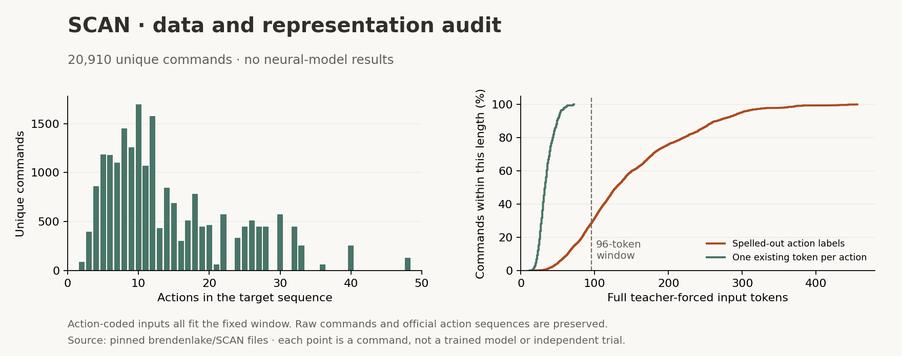

# Language-to-action transfer: data and experimental design

Data preparation is complete; neural fitting and physical instruction execution
have not started. This stage prepares a standard test of whether text pretraining
helps a model learn command interpretation. The language computation study retains
compute priority, followed by the registered BabyLM comparison. None of their
frozen inputs, checkpoints or schedules are changed by this preparation.

## Research question and scope

The existing body-feedback study uses a separately trained sensory-choice model.
It does not test language weights. Its trained controllers also match a scripted
reference, so successful steering cannot establish that language learning adds
anything. The next question is whether a language-trained model needs fewer
supervised examples or makes fewer composition errors than the same architecture
at its original random initialization.

SCAN provides commands with exact action-sequence targets and established splits
for testing new compositions. The original study found that successful
generalization under small distribution changes did not imply reliable
systematic composition.[^scan] This makes it useful for an instruction-learning
comparison, but it is an artificial symbolic task. It does not measure broad
conversation quality, visual grounding or biological motor learning.

gSCAN extends this family of questions to commands whose interpretation depends
on a grid-world state, including object attributes and relational meanings.[^gscan]
That is a possible later grounding benchmark. Neither dataset is a validated
fruit-fly sensory pathway. FLM will keep instruction accuracy, physical execution
and musculoskeletal control as separate measurements.

## Acquired data

The publisher revision is `c4b756cbc010d75c912f16c42c8f15dc6b7e6c8f`.
Nine files are acquired with exact byte sizes and SHA-256 checks, including the
complete command universe, six partition files, README and source license.[^source]
The [dataset card](../data/cards/scan.json) records every file and transformation.

| Official split | Training rows | Unique training commands | Test commands | Question |
|---|---:|---:|---:|---|
| Simple | 16,728 | 16,728 | 4,182 | New commands sampled from the same grammar |
| Length | 16,990 | 16,990 | 3,920 | Longer action sequences than those in training |
| Added primitive: jump | 14,670 | 13,204 | 7,706 | Use a familiar primitive in unseen compositions |

These are three partitions of the same 20,910-command universe, not three
independent corpora. Each must have separate training state, output directory
and evaluation. Combining their training sets would contaminate their tests.
The length split separates outputs of at most 22 actions from longer outputs.
Commands contain at most nine words, while outputs reach 48 actions.

The added-primitive training file contains 1,467 copies of the isolated jump
command: exactly 10% of its rows. This deliberate weighting is retained, including
the original row order and source-line numbers. Deduplicating it would change
the benchmark. Stable command IDs let later code detect accidental split mixing
without treating repeated rows as additional independent observations.

No command crosses the official train/test boundary within a split. Nevertheless,
3,567 of 4,182 simple-split test commands have an action sequence also produced by
a training command. Different wording can legitimately denote the same behavior.
The length and added-primitive tests have no such target-sequence overlap. This
audit motivates reporting the splits separately; it is not a learned-model score.

An independent implementation of the published grammar and interpretation rules
matches every source target.[^grammar] It is used only to detect data corruption.
It must never supply, repair or replace model predictions. Raw source files and
processed command records remain local. The exact upstream BSD notice is
preserved in [SCAN-BSD.txt](../licenses/SCAN-BSD.txt); GitHub's metadata says
`NOASSERTION`, so the card does not invent a publisher SPDX assertion.

## Representation without an accidental context advantage



This [generated figure](../scripts/scan_data_report.py) derives from a
[per-command measurement table](../public/research/figures/scan-encoding.csv).
The [machine-readable audit](../public/research/scan-data.json) records the exact
tokenizer, codec and code identities. It contains data measurements only.

Literal action labels such as `I_TURN_LEFT` are expensive under the existing
WikiText byte-BPE vocabulary. With the command prompt, they produce inputs up to
456 tokens long; 14,836 of 20,910 examples exceed the comparison transformer's
96-token attention window. This would confound composition with an avoidable
output-format burden. Sliding attention can still carry information through
intermediate states, so exceeding the window is not equivalent to erasing all
earlier information.

The prepared representation uses the original BPE vocabulary for the command
and six existing single-byte IDs for actions:

| Action | Output symbol |
|---|---|
| Walk | `W` |
| Look | `O` |
| Run | `R` |
| Jump | `J` |
| Turn left | `<` |
| Turn right | `>` |

The output is assembled as individual action IDs, without BPE-merging adjacent
symbols. Thus one generated token represents one action. This changes the label
encoding, not the official action sequence; the codec is fully reversible and
adds no parameters or vocabulary entries. Every complete teacher-forced input
now fits within 72 tokens, inside the shared 96-token window. Each architecture
receives exactly this same representation.

The prompt is `IN: {command}` followed by a newline and `OUT:`. Only the action
positions and final EOS receive supervised loss. The generation prefix ends at
`OUT:` and never includes a gold action. All 20,910 commands passed independent
prefix, target-mask and action-roundtrip checks under the real tokenizer.
Official test structural metadata was inspected for this representation audit;
no neural predictions, test losses or selected checkpoints were inspected.

## Planned matched comparison

The intended first comparison crosses FLM, GRU and transformer with original
initialization versus the selected WikiText checkpoint, both original training
seeds, and all three SCAN splits: 36 fits. This is a comparison of transfer at
matched downstream exposure. The pretrained conditions have already consumed
WikiText data and compute; their lifetime training budgets are not equal to
the random-initialization controls.

All conditions use the existing architectures, vocabulary and parameter counts.
Training rows, repeated-row weights and sampled exposure must match within a
split and seed. Each example resets state. Full instruction/action sequences
fit the common context, so training need not discard a prefix or truncate a gold
target. The initial study will fit all original parameters by supervised
next-token loss. It is not a local-plasticity or reward-learning result.

Before these fits begin, a train-only timing pilot must set and freeze the
optimizer, downstream update budget, batch schedule, numerical source identities
and completion gate. SCAN supplies no official validation set. The planned
comparison will preserve all official training rows and use a fixed terminal
checkpoint instead of selecting a checkpoint on test accuracy. Any change to
that plan requires a declared protocol before fitting, with its implications
for comparison stated explicitly.

Primary evaluation will use greedy generation over the entire original
vocabulary, with a fixed output cap and no grammar-constrained decoding. Exact
success requires the complete correct action sequence and EOS. Invalid IDs,
extra actions, omissions, wrong order and output-cap exhaustion remain errors.
Edit distance, invalid-output rate and results by target length are secondary
diagnostics. The implemented scorer already rejects treating a correct prefix,
an unfinished trace or an equivalent final position as exact success.

Report every run and both seeds, including transfer regressions. Differences
between initial and pretrained FLM may come from lexical embeddings, recurrent
dynamics, timescales or the readout. A transfer benefit alone cannot locate
knowledge in a particular circuit. Fixed-core/readout-only and component-reset
controls are needed before attributing an effect specifically to recurrent
learning. Likewise, the separate language topology study remains necessary for
an anatomical-prior claim. Command-level intervals would condition on the fitted
models and related grammar-generated examples; they are not extra training seeds.

## Physical follow-on

Score the entire symbolic benchmark first. Only then execute a predeclared
walk/turn subset through a separately calibrated physical interpreter. The
simple and length tests contain 650 and 386 such commands, respectively; the
added-jump test contains none. These counts describe candidate coverage, not
successful simulations. Run, jump and look must not be silently mapped to walking.

The physical layer needs a fixed distance per walk, heading change per turn,
timeout policy, initial conditions and reference execution. Those calibration
choices must be fixed before selecting neural outputs to simulate. All models
must use the same designed lower-level gait and pose controller. Record the
predicted sequence, real language-model states, requested commands and actual
body trajectory, retaining invalid predictions and failed executions. Report
symbolic correctness separately from whether the physical body followed its
requested path. A scripted reference remains essential.

## Runtime preparation

The [shared numerical runtime](../flm/scan_runtime.py) now connects the prepared
representation to FLM, GRU and transformer models. It right-pads complete
examples, preserves repeated training rows, resets state per example, and
computes mean next-token loss only over action IDs and EOS. Each supervised
token has equal weight; longer targets contribute more terms than shorter ones.
Unscored instruction tokens still receive gradients through causal computation.

Generation batches equal-length prefixes, uses the full original vocabulary,
and restores the caller's command order. Each row stops independently at EOS or
the declared cap. Invalid token IDs remain in the trace. Supplied predictions
are decoded again from raw IDs before scoring; altered labels, shortened traces
and mismatched command/cap records are rejected. Aggregates retain every supplied
example, report exact sequence success and edit distance, and distinguish
invalid-token outputs, invalid or empty action sequences, and cap exhaustion.
Length breakdowns use the reference action count. Official partition coverage
must still be established by the future study harness.

Nine [runtime fixture checks](../reports/scan-runtime/preflight.json) cover
masked loss, per-example versus padded-batch gradients, instruction-prefix
credit, cached versus whole-prefix greedy generation, and failure accounting.
They use small synthetic networks and an independent byte codec, not acquired
SCAN examples or the full trained checkpoints. These are implementation checks,
not benchmark scores.

The [fitting primitives](../flm/scan_train.py) additionally support resumable CPU
updates with explicitly supplied optimizer settings and a warmup/cosine schedule.
They sample uniformly with replacement over the ordered training rows, so
deliberate duplicate rows keep their sampling weight. Checkpoints bind the
starting model, model class/configuration, tokenizer, ordered records, source
versions and settings, and count both input and supervised-token exposure.
An OS-held lease excludes a second writer. Only checkpoints with a final commit
record can resume; a leftover payload from an interrupted save is replayed.

Nine [training/recovery fixture checks](../reports/scan-runtime/training-preflight.json)
use six-update runs on the same three tiny architectures. In the recorded
one-thread environment, interrupted/resumed runs match uninterrupted tensors,
optimizer moments, RNG state, sampled exposure and loss history exactly. Changed
starting weights, data, tokenizer or schedule reject resume. Nonfinite final
updates cannot commit a completion record. These checks do not establish
bitwise replay for a future full-size, multithreaded training configuration.

The [training-only partition loader](../flm/scan_inputs.py) verifies the chosen
raw training file against the pinned publisher bytes, then compares every
processed row with its parsed source. Five corruption tests and the
[three-partition check](../reports/scan-runtime/input-preflight.json) verify
order, source lines and multiplicities, including all 1,467 isolated jump rows.
Updating a processed checksum does not permit deduplication or rearrangement.
The loader opens neither the test partition nor the complete command universe.

The [language-source audit](../scripts/scan_source_audit.py) reconstructs all six
original model initializations from their recorded Git source and compares them
with the current constructor. All initial tensors and fixed buffers match.
For each selected language checkpoint, historical and current implementations
also produce exactly equal logits on two synthetic token rows carried through
chunks of 96 and 15 positions. The [recorded evidence](../reports/scan-runtime/source-preflight.json)
contains the initial and trained state hashes and every measured difference.
The current transformer copies its bounded attention cache, while the historical
implementation retained views. These one-thread forward probes verify the
observed cases, not all inputs, backward trajectories or multithreaded replay.
No corpus, SCAN prediction or fitting is involved in this source audit.

The [condition layer](SCAN-CONDITION-PREPARATION.md) now binds original sources
at fit/resume. A [whole-study coordinator](SCAN-STUDY-COORDINATOR.md) implements
immutable declaration, serial fitting and an all-36 terminal-checkpoint audit.
The [whole-partition test harness](SCAN-EVALUATION.md) now binds official row
membership and resumable raw generation to that gate. The actual train-only
timing pilot and optimizer/budget declaration remain pending before any official
benchmark fits begin. Preparation records are not a frozen study or a transfer result. The
fixed BabyLM comparison and chosen neuron-selection study retain priority.

## Reproduction and current boundary

```sh
python -m flm.scan
python -m unittest discover -s tests -p test_scan.py -v
python -m unittest discover -s tests -p test_scan_runtime.py -v
python -m unittest discover -s tests -p test_scan_train.py -v
python -m unittest discover -s tests -p test_scan_inputs.py -v
python -m scripts.scan_source_audit
python scripts/scan_data_report.py
```

Acquisition and grammar tests need the repository's base Python environment.
The complete encoding/figure audit additionally uses the existing WikiText
tokenizer and the declared language/research dependencies. Thirteen focused
tests cover source corruption, repeated examples, split integrity, causal target
boundaries, action coding and strict sequence scoring. These commands do not
start a trainer, change a language checkpoint or run MuJoCo. Fitting and physical
instruction execution remain unfinished work.

## Sources

[^scan]: Brenden Lake and Marco Baroni. *Generalization without Systematicity: On the Compositional Skills of Sequence-to-Sequence Recurrent Networks*. ICML / PMLR 80, 2018. [Publisher paper](https://proceedings.mlr.press/v80/lake18a.html).
[^source]: Brenden Lake and Marco Baroni. *SCAN tasks for compositional learning*. [Pinned repository](https://github.com/brendenlake/SCAN/tree/c4b756cbc010d75c912f16c42c8f15dc6b7e6c8f), acquired 10 September 2026. The exact upstream license and all nine source hashes are retained.
[^grammar]: Lake and Baroni, 2018. *Supplementary materials*, figures 1–2. [Grammar and interpretation rules](https://proceedings.mlr.press/v80/lake18a/lake18a-supp.pdf).
[^gscan]: Laura Ruis, Jacob Andreas, Marco Baroni, Diane Bouchacourt and Brenden M. Lake. *A Benchmark for Systematic Generalization in Grounded Language Understanding*. NeurIPS 2020. [arXiv version 2](https://arxiv.org/abs/2003.05161v2).
