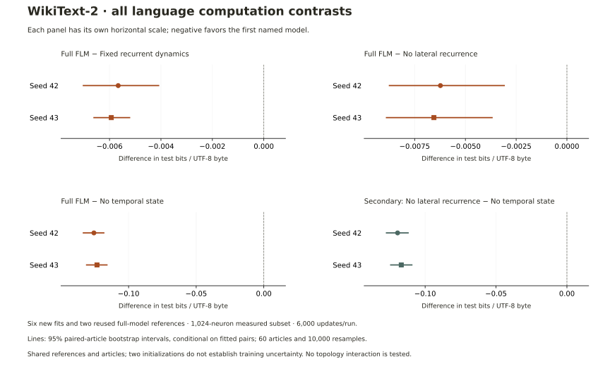
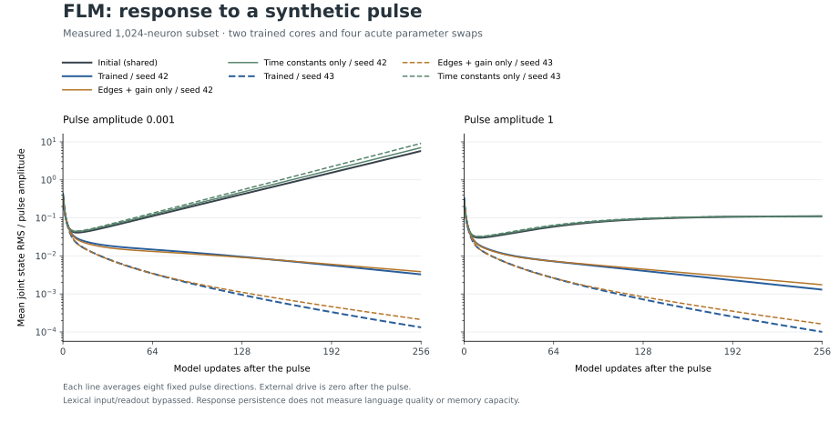

# Where prediction capability resides in FLM

Kuber Mehta · 12 September 2026 · Synthesis of completed records, with no new fitting or statistical resampling.

**In the completed WikiText implementation, carrying temporal state helps prediction substantially more than the additional benefit measured for lateral communication or optimized recurrent dynamics.** This is a finding about the implemented computation. Whether the measured connection arrangement contributes a distinctive advantage remains a separate, bounded hypothesis.

## What each model can still do

| Model | Computation retained | Mean held-out BPB |
|---|---|---:|
| Full FLM | Learned text interface, fast/slow state and optimized graph-mediated communication | 1.974383 |
| Fixed recurrent dynamics | Learned text interface and history through the initialized recurrent dynamics | 1.980180 |
| No lateral recurrence | Learned text interface and fast/slow temporal units before pooling; no `W h` communication | 1.980773 |
| No temporal state | Learned current-token nonlinear predictor; both states reset for each token | 2.098893 |

Values are descriptive means over two training seeds, scored on all 60 WikiText test articles. The [complete report](LANGUAGE-CORE-RESULTS.md) retains unrounded source arithmetic, every per-seed difference, all article scores and the original conditional intervals. These are validation-selected retrained controls, not inference-time switches applied to one checkpoint.

The especially informative secondary comparison is **no lateral recurrence versus no temporal state**, whose mean difference is **−0.118120 BPB**. Both lack effective graph-mediated history. Retaining the independent temporal units improves prediction in both seeds. Pooling, normalization and the lexical readout still combine their features; “no lateral recurrence” does not mean a model with no memory or no learned computation.

Full FLM has smaller favorable differences versus no lateral recurrence (**−0.006391 BPB**) and fixed dynamics (**−0.005797 BPB**). All six primary per-seed conditional article intervals exclude zero in the favorable direction, but they condition on these particular fitted models and articles. Their effect sizes do not establish generality across corpora, training seeds or graph selections.

## What this explains, and what it leaves open

The implemented text interfaces and temporal units offer a concrete route to language prediction even without communication along the fly-derived edges. Full FLM adds a measured improvement on top of that control. This explains why successful generation through an anatomically placed network is insufficient evidence that its biological arrangement is helpful.

The fixed-dynamics control also has a learned input interface: gradients pass through its fixed state evolution. Its performance cannot be described as a readout-only reservoir result. It freezes 78,179 entries and trains 521,824. All conditions store 600,003 entries, while the no-lateral and no-temporal variants each disconnect 76,131 edge/gain entries from the objective. These are implemented mechanism comparisons, not matched effective-capacity estimates.

Do not turn these contrasts into a percentage of intelligence, an additive allocation of prediction quality or a factorial decomposition. There is no crossed topology-by-trainability experiment here. The separate completed rewiring comparison does not show an anatomical advantage in the original selected subset. Its scope is different from the favorable full-versus-no-lateral result: useful communication does not establish that the measured endpoints are better than matched alternatives.

## Training changes dynamics; usefulness requires a separate measurement

The existing [pulse diagnostic](LANGUAGE-DYNAMICS-FINDINGS.md) shows a zero-state fast spectral radius of 1.020729 at initialization, 0.991243 after seed-42 training and 0.872189 after seed-43 training. Copying learned edges and gain together into the initial core largely reproduces the shift; copying only time constants does not. The slow branch retains a distinct decay scale, and the two trained models have different pulse responses despite similar language losses.

That supplies a measurable training-induced change, not an explanation already proven to cause better language memory. It concerns fixed directions and finite horizons near or departing from zero state, with no normal lexical drive. It establishes neither global stability nor recoverability of earlier text. A future mechanism-specific explanation would need a declared intervention or readout that distinguishes useful retained information from merely persistent activity; this synthesis does not launch that experiment.

## The next decision

The [prospective anatomical-prior rule](ANATOMICAL-PRIOR-DECISION.md) turns the running KC-centered comparison into a bounded decision. A consistent and sufficiently large candidate-versus-rewire gain permits one independent confirmation; a valid completed failure ends anatomical subset searches in this program. Candidate-versus-ranked/random outcomes remain visible with their allocation differences.

The contribution now is to connect **a defined model, an observed change, a control that isolates a mechanism, and the limits of that inference**. The existing records support that account today; a larger inventory of models is not required to state it.
