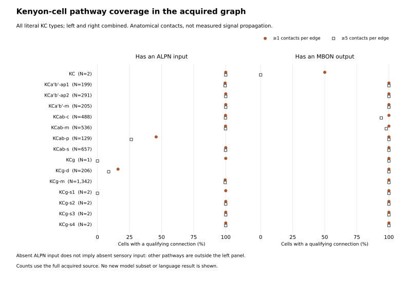

# Candidate pathways before selecting a functional subset

This anatomy-only audit follows the [selection feasibility study](SELECTION-STUDY.md)
and [publisher annotation reconciliation](PUBLISHER-ANNOTATIONS.md). It measures
connections between candidate input, Kenyon-cell, output and modulatory groups
in the acquired 166,700-neuron runtime. It has not selected a new language graph,
trained a candidate or demonstrated preservation of a biological computation.

The important change is from counting cell labels to checking directed pathways.
The existing 1,024-neuron model includes no Kenyon cells. A result from that subset
cannot test the usefulness of the Kenyon-cell computation it excludes.

## What the body-pair graph contains

The audit verifies all six source-file hashes against the frozen graph card and
the candidate annotation CSV against the publisher reconciliation. It scans
all 25,582,938 directed connections. CSR rows are postsynaptic; presynaptic
source signs determine which contacts the existing fast-edge rule retains.

`ALPN` uses the publisher's curated class. `KC`, `MBON`, `PAM`, `PPL1`, `APL` and
`DPM` use literal case-sensitive type prefixes. These seven disjoint groups
contain 5,183 cells; the remaining cells form an explicit `other` group. None of
these labels establishes synapse location or compartment membership.

| Directed group pair | Raw contacts | Body-pair edges | Contacts retained by fast-sign rule |
|---|---:|---:|---:|
| ALPN → KC | 390,928 | 22,586 | 390,928 |
| KC → MBON | 463,640 | 61,210 | 463,640 |
| PAM → KC | 173,789 | 110,450 | 0 |
| PPL1 → KC | 49,256 | 17,149 | 0 |
| PAM → MBON | 28,546 | 2,693 | 0 |
| PPL1 → MBON | 11,070 | 430 | 0 |

Only **314 of the 686 ALPN-class cells** have any acquired connection to a KC;
271 have at least one KC connection with five or more contacts. Adding every
ALPN label would therefore include many cells without a direct KC connection
in this representation. This is a reason to inspect partners, not a license to
select only the strongest ones after seeing language scores.

| KC coverage in the full acquired graph | ≥1 contact on each qualifying edge | ≥5 contacts on each qualifying edge |
|---|---:|---:|
| Total Kenyon cells | 4,064 | 4,064 |
| Has an ALPN input | 3,812 | 3,768 |
| Has an MBON output | 4,063 | 4,022 |
| Has both | 3,811 | 3,726 |

These are body-level two-hop existence counts, not propagation measurements.
The threshold applies separately to each body pair: two three-contact inputs
do not constitute a five-contact edge. Both thresholds are reported as a
sensitivity check, without choosing a preferred threshold from these results.
The totals use all acquired group members, not a proposed induced subgraph.



## Missing ALPN input is not missing sensory input

The low ALPN coverage is concentrated in some types. For example, the 206
`KCg-d` cells have 33 ALPN-connected members at the one-contact threshold and 18
at five contacts; all 206 have MBON outputs at either threshold. The 129
`KCab-p` cells have 59 and 34 ALPN-connected members respectively, while all
129 have MBON outputs. All exact type/side strata, including rare and generic
labels, remain in the [coverage CSV](../reports/selection-pathways/kenyon-coverage.csv).

Ganguly et al. describe direct visual projection and local visual interneuron
routes to visual Kenyon-cell populations in FlyWire/hemibrain. They also find
structured upstream connectivity alongside KC input sampling consistent with
biased randomness. That motivates pathway-specific controls and cautions against
treating absence of ALPN input as sensory isolation. It does **not** establish
that these MaleCNS body IDs retain the same complete pathways. Their discussion
identifies MBON19/27/33 as candidate visual-biased outputs; transferring that
candidate to this graph still requires checking its actual inputs and external
partners. [Ganguly et al., 2024](https://www.nature.com/articles/s41467-024-49616-z)

The audit exports **every** connected external type/superclass/side stratum,
not just favorable examples. For example, `MB-C1` contributes 21,028 contacts to
KCs across five cells, outside the seven named groups. The
[external-partner CSV](../reports/selection-pathways/external-partners.csv)
keeps both directions, contacts, edge counts, connected-cell counts and retained
fast contacts. Here “external” excludes all seven named groups; it is not the
complete boundary of an individual group or a selected input interface.

## Selection cannot repair a missing learning mechanism by itself

The four PAM/PPL1 rows above sum to **262,661 raw contacts onto KCs and MBONs**,
all removed by the current runtime's zero-fast-sign rule. The publisher's
`ground_truth` field labels all 332 PAM/PPL1 cells dopamine, as recorded in the
separate reconciliation. Selecting these cells alone would not restore their
outgoing influence in the existing model. A modulatory channel and a plasticity
rule would be additional model choices and need their own matched controls.

DPM remains a separate uncertainty. The acquired consensus predicts dopamine
for its two cells, with empty publisher `ground_truth` fields. Ganguly et al.
discuss DPM as serotonergic in the biological literature. The runtime prediction
must not be promoted to established DPM physiology or used uncritically to
assign its role. [Ganguly et al., 2024](https://www.nature.com/articles/s41467-024-49616-z)

## Consequences for the next experiment

1. Establish an explicit sensory-input/KC/output unit, with its inhibitory and
   modulatory partners, from annotated body IDs and relevant compartment evidence.
   Record both retained and excluded contacts. A recognizable family name or
   two-hop path alone is insufficient.
2. Choose a common neuron budget around a defensible unit, then compare it with
   contact ranking, uniform random and declared stratified random selections.
   Report density, signs, parameters and compute; equal node counts do not make
   all these quantities equal.
3. Test retained topology within each selected set using independently rewired
   controls. Consider separately declared pathway-constrained shuffles to locate
   which stage contributes, while preserving input/output identities. Do not
   replace the primary null model after seeing a favorable result.
4. Hold dynamics and language interfaces fixed in the selector comparison.
   Test modulatory plasticity as a separate extension with equivalent machinery
   in its controls. Freeze the final graphs, thresholds, seeds, exposure and
   contrasts before fitting.

This audit narrows the next selection work; it does not finish circuit validation.
Current BabyLM training and completed topology, computation and sensory studies
retain their original identities and results.

## Reproduction and checks

```powershell
python -m unittest discover -s tests -p test_selection_pathways.py -v
python -m flm.selection_pathways
python -m scripts.selection_pathway_figures
```

Three fixture tests check literal directed enumeration, zero-sign removal,
per-edge thresholding, two-hop coverage, annotation joins and invalid inputs.
Each scan checks conservation using independently accumulated incoming and
outgoing arrays. The [summary](../reports/selection-pathways/summary.json)
binds source and output hashes; the [64 directed group pairs](../reports/selection-pathways/directed-groups.csv)
include all directions and the `other` group. The
[audit source](../flm/selection_pathways.py) opens no language corpus or checkpoint.
Reproduction requires the already acquired runtime and reconciled annotations.
