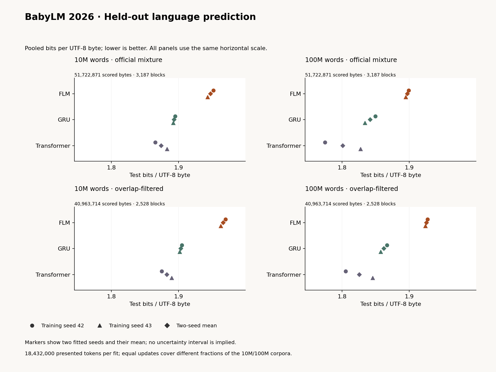

# BabyLM: completed compact language comparison

Kuber Mehta · 12 September 2026

**FLM has higher pooled held-out loss than the GRU and transformer at both training-data sizes, on both the official mixture and the overlap-filtered subset.** The larger training pool improves all three architectures' two-seed mean pooled scores under the same finite update budget. This does not demonstrate an anatomical advantage: these twelve fits use the original ranked 1,024-neuron FLM subset and contain no BabyLM rewired or alternative-selection controls.

The [complete report](babylm-results/summary.json), [168 score rows](babylm-results/tables/scores.csv), [84 seed aggregates](babylm-results/tables/seed_aggregates.csv) and [16 paired comparisons](babylm-results/tables/paired_comparisons.csv) retain every condition. This is the project's declared compact comparison, not an official BabyLM Challenge submission or an external challenge leaderboard score.

## What was compared

The [training protocol](babylm-protocol.md) specifies three approximately 600,000-parameter models: FLM (600,003), GRU (595,408), and a two-layer causal transformer (607,468), each at nominal 10M/100M-word training budgets with seeds 42/43. All learn from scratch. They share the lossless 4,096-ID byte-BPE tokenizer fitted on 10M training text, sampled-window procedure, AdamW schedule, batch 16 and 96-position training windows with 16 warmup positions. Within a scale and seed the architectures receive the same sampled exposure. Similar parameter counts and matched updates do not mean equal runtime or identical effective capacity.

Every fit completed 12,000 updates: **18,432,000 input-token presentations and 15,360,000 supervised positions after warmup**. These are repeated sampled presentations, not unique tokens or words. The 100M cache contains 189,709,779 text tokens, versus 18,591,514 in 10M. The 100M experiment therefore does **not** train for one full corpus epoch; even the near-corpus-size 10M presentation count does not imply each token was visited. The [sampler](babylm-results/train.py) draws eligible 97-token slices with replacement, weighting blocks by available start positions; this is not a shuffled document epoch or a curriculum. Training resets state for each finite window and includes boundary targets after warmup. Evaluation excludes inserted boundaries and carries each model's native state through complete blocks; the transformer retains its 96-position attention window.

The [twelve checkpoint selections](babylm-results/selection.json) were frozen before held-out inference. Selection uses the earliest minimum over 24 fixed-panel validation observations per fit, not test performance. Eleven selected checkpoints are at update 12,000; the 100M transformer seed-42 checkpoint is at 11,500. The common 12,000-update budget describes completed training, not identical exposure at every selected checkpoint. Source/checkpoint/history audits authenticate the saved records; they do not independently reconstruct every historical optimizer update.

## Pooled held-out results

Bits per byte (BPB) is total next-token negative log likelihood divided by log(2) and exact UTF-8 target bytes; lower is better. It is byte-weighted pooling, not an unweighted mean of component BPBs. Same-tokenizer perplexities remain in the score CSV; BPB is not word-token perplexity.

| Training pool | Model | Official mean BPB (seed SD) | Filtered mean BPB (seed SD) |
|---|---|---:|---:|
| 10M | FLM | 1.947712 (0.006020) | 1.966842 (0.004968) |
| 10M | GRU | 1.893743 (0.001985) | 1.903578 (0.002368) |
| 10M | Transformer | 1.874470 (0.012536) | 1.882700 (0.010690) |
| 100M | FLM | 1.897191 (0.002927) | 1.925800 (0.002194) |
| 100M | GRU | 1.841673 (0.010796) | 1.862178 (0.006699) |
| 100M | Transformer | 1.801002 (0.037759) | 1.825476 (0.028519) |

Each mean and sample standard deviation uses **two training seeds**. SD is not a confidence interval. The [individual seed scores](babylm-results/tables/scores.csv) matter: for example, official 100M transformer BPB is 1.774303 at seed 42 and 1.827702 at seed 43.

*Circles and triangles are fitted seeds; diamonds are their means. No uncertainty interval is shown.*

On the official mixture, FLM-minus-GRU mean differences are **+0.053969 BPB (10M)** and **+0.055518 (100M)**; FLM-minus-transformer differences are **+0.073243** and **+0.096189**. Filtering retains the same ordering: respectively **+0.063264/+0.063623** against GRU and **+0.084141/+0.100324** against transformer. All sixteen declared per-seed pooled 95% paired-block intervals lie above zero.

Those intervals use 10,000 paired resamples within each corpus component, with fixed generator seed 31415. They condition on the fitted checkpoints and observed component block counts. Artificial neighboring blocks may share unknown books, speakers or conversations; these are **not independent-document intervals or a distribution over training runs**. The two seeds, shared test set and repeated official/filtered measurements are not independent experiments. No component-level intervals, cross-scale improvement intervals or multiplicity-adjusted family inference were declared here.

## Overlap and component differences

The official score includes **3,187 blocks, 18,177,107 text targets and 51,722,871 target bytes**. The fixed sensitivity analysis excludes 659 entire blocks containing a substantial normalized line present in either training partition: **10,759,157 bytes** are removed, leaving **2,528 blocks, 13,927,273 targets and 40,963,714 bytes**. The same exclusion applies to every model and both data sizes. Scores reuse the same block likelihoods; filtering does not change model weights or splice text.

| Component | Official blocks | Excluded blocks | Excluded target bytes |
|---|---:|---:|---:|
| BNC spoken | 300 | 4 | 64,708 |
| CHILDES | 899 | 408 | 6,677,120 |
| Gutenberg | 830 | 53 | 858,794 |
| OpenSubtitles | 635 | 90 | 1,472,280 |
| Simple Wikipedia | 472 | 104 | 1,686,255 |
| Switchboard | 51 | 0 | 0 |

The filter detects complete normalized lines of at least eight words and 40 characters, not near-duplicates, short phrases or partial-line overlap. Removing whole blocks changes the component mixture and text difficulty; a higher filtered score cannot be attributed solely to memorization. Neither analysis establishes contamination-free evaluation or document/speaker-disjointness.

The table reports **FLM minus the named baseline**, averaged over seeds. Negative favors FLM.

| Training pool | Component | Official Δ vs GRU | Official Δ vs transformer | Filtered Δ vs GRU | Filtered Δ vs transformer |
|---|---|---:|---:|---:|---:|
| 10M | BNC spoken | +0.057393 | +0.077210 | +0.057493 | +0.077280 |
| 10M | CHILDES | -0.018288 | -0.018148 | -0.021805 | -0.018760 |
| 10M | Gutenberg | +0.094888 | +0.117185 | +0.094682 | +0.116750 |
| 10M | OpenSubtitles | +0.072917 | +0.098144 | +0.072449 | +0.097508 |
| 10M | Simple Wikipedia | +0.086451 | +0.127463 | +0.095019 | +0.130490 |
| 10M | Switchboard | +0.123940 | +0.156689 | +0.123940 | +0.156689 |
| 100M | BNC spoken | +0.058690 | +0.077538 | +0.058783 | +0.077599 |
| 100M | CHILDES | -0.025843 | +0.054992 | -0.030619 | +0.056991 |
| 100M | Gutenberg | +0.098166 | +0.117949 | +0.098001 | +0.117690 |
| 100M | OpenSubtitles | +0.073254 | +0.095863 | +0.072600 | +0.095057 |
| 100M | Simple Wikipedia | +0.107042 | +0.148109 | +0.104404 | +0.146921 |
| 100M | Switchboard | +0.100781 | +0.115102 | +0.100781 | +0.115102 |

**CHILDES is the only component where FLM has a lower two-seed mean than a baseline.** It is below GRU at both scales and in both analyses, also separately at both training seeds. At 10M its mean is below transformer, but seed 42 favors transformer and seed 43 favors FLM. At 100M the mean favors transformer, again with opposite signs by seed. Thus the component exception is real in these recorded values, but is not a demonstrated general advantage on child-directed speech, conversational competence or biological learning. The five other component means favor both baselines in every scale/subset cell.

## All 288 continuations, including failures

The [complete sample inventory](babylm-results/samples.json) contains all twelve predefined prompts, sampling seeds 17/29 and all twelve selected models. Prompt groups—conversation, narrative, explanation and procedural text—label inputs, not validated capabilities. Sampling uses PyTorch CPU multinomial, temperature 0.8, top-k 40 and a 256-new-token cap; every prompt resets the model and sampling generator. BOS and tokens containing ASCII control bytes other than newline/tab are excluded for display. EOS remains allowed; this filter is absent from likelihood scoring.

**All 288 continuations reached the 256-token limit; none stopped at EOS.** One continuation from 100M GRU seed 42 has invalid UTF-8 and is retained with its decoding flag and replacement-decoded display text. Token IDs and generated-byte hashes remain in the records. The [completed evidence audit](babylm-results/completed-evidence-verification.json) verifies all sample identities, prompt/seed combinations, decoding and repetition arithmetic without regenerating samples or judging meaning. A display filter and replacement decoding do not establish valid language, safe content or successful answers.

| Training pool | Model | Mean repeated 4-gram fraction | Mean distinct bigram fraction | Mean longest same-token run |
|---|---|---:|---:|---:|
| 10M | FLM | 0.2717 | 0.5542 | 37.75 |
| 10M | GRU | 0.0693 | 0.7818 | 1.38 |
| 10M | Transformer | 0.0638 | 0.7609 | 1.33 |
| 100M | FLM | 0.2122 | 0.6205 | 32.31 |
| 100M | GRU | 0.0744 | 0.7575 | 1.56 |
| 100M | Transformer | 0.0697 | 0.7539 | 1.58 |

Each row includes **all 48 continuations** for its architecture and scale, equally weighting prompts and both training/sampling seeds. Repeated 4-gram fraction is one minus the number of unique token 4-grams divided by their total count; the other measures also operate on BPE tokens. These are descriptive degeneration measures, not semantic-quality scores or independent-trial estimates. FLM has more repetition by these summaries. Lower pooled likelihood loss does not by itself establish a useful chatbot for any architecture.

Reading the first declared conversation prompt at sampling seed 17 across all twelve checkpoints shows recognizable dialogue formatting mixed with topic drift and malformed responses; FLM examples also fall into word or punctuation loops. This is a fixed inspection slice, not a quality-selected gallery. The full inventory, rather than those examples or prompt-category names, is the evidence. No factuality, instruction-following or human-preference evaluation is reported.

## Recovery, reproducibility and the next question

The first evaluation attempt completed one model's block scoring but failed while assembling its result because `checkpoint_step` was supplied twice. The [recovery record](babylm-handoff.md#evaluation-recovery) preserves the failed cache and documents the correction. Source identities changed, so corrected scoring started fresh from the same frozen checkpoints rather than reusing that cache. The corrected supervised sequence completed all twelve scores, all 288 continuations and the separate selection timing inventory.

The [table manifest](babylm-results/tables/manifest.json) binds exported CSV/JSON files. The exporter checked recorded sums, metric arithmetic and artifact identities; it did not rerun inference, restore weights, read raw test tokens or independently repeat the bootstrap. This note additionally checks the BPB/perplexity arithmetic and two-seed aggregates against the complete report. Those verification scopes must not be described as independent training replication.

The [selection timing report](selection-pilot/timing.json) contains **64 original graph configurations**, each with three warmup and twelve measured disposable updates on shared BabyLM training windows. It measures short-run cost, not language quality; the 192 rewires were not timed. Its fixed pilot rate is not the future learning schedule, and initialization, checkpoint I/O and validation are outside the timed update. The pilot itself chooses no group or budget. A subsequent [registered protocol](selection-language-protocol.md) and [immutable identity](selection-language/study-identity.json) freeze both `KCg-d-L-t5` and `KCg-d-R-t5`: **128 complete-group fits at 3,000 updates each**. The serial training, validation-selection and held-out queue has started, with no selection-language result yet. Its 4,608,000 input-token presentations per fit define a limited-exposure screen, not convergence or an equal-budget replacement for the twelve BabyLM baselines. The [protocol wording correction](selection-language-errata.md) confirms that both training paths include boundary targets after warmup; the frozen experiment is unchanged. All 128 fits must finish before validation selection; all selected checkpoints must be frozen before test access.

The active inferential priority is this complete comparison of operational KC-centered selection, contact ranking and matched random selections, with within-subset rewiring controls, before further scaling. The existing WikiText topology result stays narrow: no anatomical advantage for its ranked subset/setup. BabyLM adds a larger, standard corpus comparison and enough fixed outputs to inspect failure modes; it does not answer whether a different circuit selection or learning rule helps. Local learning, SCAN and food adaptation remain separate prospective studies, with no language-to-behavior benefit demonstrated by these scores.
