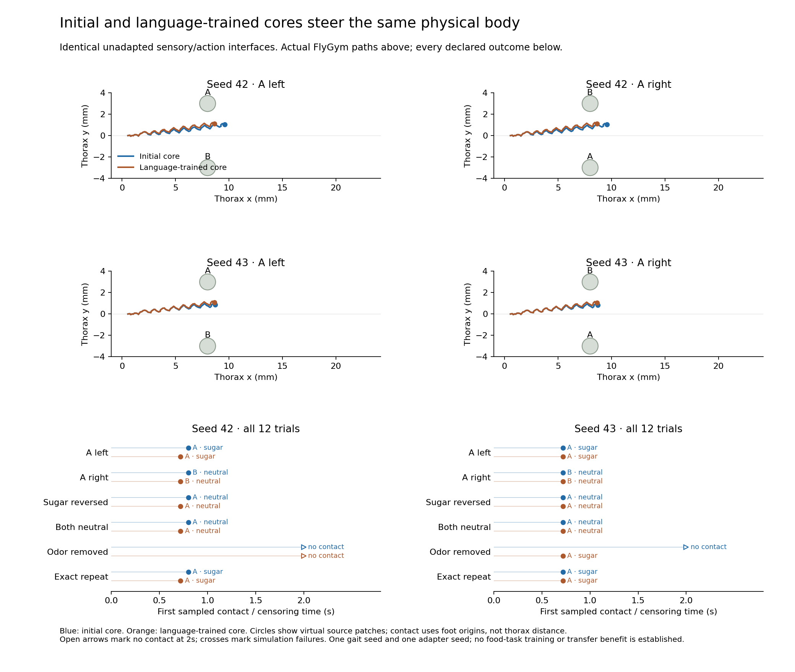

# Initial and language-trained cores in the food reference

Kuber Mehta · 11 September 2026. All **24 declared trials completed**, with
zero simulation failures and zero food-task training updates. This is a
physical interface reference, not evidence that language training teaches food
association. The [prior declaration](food-core-physical-reference.md) remains unchanged.

## Complete outcomes

The two core initialization seeds (42/43) each have initial and WikiText-trained
versions, with identical fresh sensor and action adapters (seed 711). Each
version runs six conditions through the same gait controller (seed 17), for
two simulated seconds. There are 201 observations per trial at 100 Hz and
20,000 physics steps per trial. The final recorded neural command is not applied
beyond the time horizon. Both sources are virtual patches; contact is measured
at foot origins, not by distance from the thorax.

| Condition | Initial 42 | Language 42 | Initial 43 | Language 43 |
|---|---|---|---|---|
| A left | A, sugar, 0.80 s | A, sugar, 0.72 s | A, sugar, 0.72 s | A, sugar, 0.72 s |
| A right | B, neutral, 0.80 s | B, neutral, 0.72 s | B, neutral, 0.72 s | B, neutral, 0.72 s |
| Sugar reversed | A, neutral, 0.80 s | A, neutral, 0.72 s | A, neutral, 0.72 s | A, neutral, 0.72 s |
| Both neutral | A, neutral, 0.80 s | A, neutral, 0.72 s | A, neutral, 0.72 s | A, neutral, 0.72 s |
| Odor removed | No contact by 2 s | No contact by 2 s | No contact by 2 s | A, sugar, 0.72 s |
| Exact repeat | A, sugar, 0.80 s | A, sugar, 0.72 s | A, sugar, 0.72 s | A, sugar, 0.72 s |

These are first **sampled** contacts. The three no-contact observations are
censored at 2 s, rather than treated as successful arrivals with a 2 s latency.
All four cores contact the upper patch in the mirrored cases, regardless of
whether that patch is A or B. The missing-odor language-43 contact shows why a
sugar contact alone cannot establish odor-guided behavior. Differences in
latency or path do not demonstrate a useful transfer effect. The exact repeat
is not an independent replicate, and one adapter/gait seed does not support
population-level uncertainty estimates.

## What was verified

The [complete audit](food-core-physical/audit.json) independently
recomputes scalar odor/contact measurements from cached sensor positions,
replays the initial and language-trained recurrent cores, checks all fast and
slow states, pooled features, logits and action probabilities, and verifies
every motor command and contact-stop latch: **4,824 observations**. It also
retains all 12 repeat/reversal/neutral array comparisons. Original trajectories
and the complete inventory are bound by hashes.

The [standalone archive verification](food-core-physical/standalone-archive-verification.json)
extracts a fresh copy and reruns the NumPy audit outside the repository. Its
98 hashed members include all 24 original records and trajectories, the four
core payloads, numerical replay code, frozen local sources and component
licenses. This verifies recorded sensor-to-command computation; it does not
independently rerun body physics. Download the
[complete archive](food-core-physical-records.zip) or
[all outcomes as CSV](figures/food-core-physical.csv).

## Recorded-state replay

The browser exposes all 24 conditions with all 201 samples each. Switching
between initial and language-trained cores preserves the time index. The
1,024 fast/slow values shown at every sample are the actual saved recurrent
states, checked against the anatomical body-ID order. The body uses all 69
native compiled meshes and geometry transforms reconstructed from saved
generalized coordinates. Playback advances exact stored samples without
interpolation and runs no new neural inference or body physics.

The [body-state note](physical-state-semantics.md) is essential: the simulator's
saved head-position row aliases a hind foot; it is preserved in raw records but
not used for head rendering. Cached sensor poses and geometry reconstructed
from `qpos` belong to different integration stages. The replay retains this
distinction; it does not recompute contact labels from the displayed meshes.
Native geometry conversion to float32 introduces a maximum absolute component
error below 0.000001 in this export (positions in mm, rotations dimensionless).
See the [replay manifest](food-core-physical/replay.json) and
[exporter](food-core-physical/export_food_replay.py).

## Next experiment remains separate

The [food-response plan](food-response-plan.md) still requires matched downstream
adaptation, unseen layouts and a declared reversal/retention phase. No such
fit has run. This physical reference establishes a working interface and a
baseline that includes wrong-source contacts and timeouts. It neither repairs
the truncated language graph nor answers the selection/topology question.
Complete selection comparisons retain priority after the fixed BabyLM queue.
