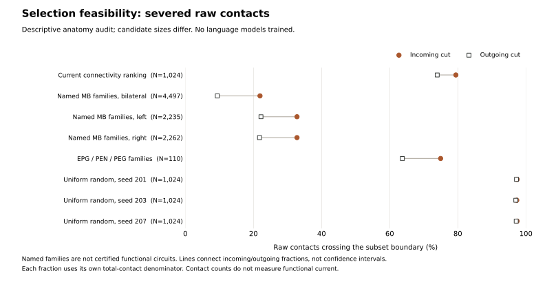

# Test neuron selection before treating size as the solution

The completed language result concerns one connectivity-ranked, strongly
truncated subset. It is not strong evidence against useful biological topology
in general. Selecting a coherent computational circuit is a different hypothesis
from retaining the highest-contact neurons or increasing their number.

The next selection study will compare a biologically motivated subcircuit,
connectivity-ranked selection and independently sampled random subsets at a
common neuron budget. This document records the anatomy-only feasibility work
and decisions still needed before freezing that language experiment. No new
selection has been trained or substituted into the current browser model.

## What the acquired source actually supports

The [new audit](selection-feasibility/selection_feasibility.py) checks the acquired source files
against the frozen graph card, scans all 25,582,938 directed connections and
records every candidate's body IDs. Its independent contact counting reproduces
the current subset's 76,130 retained fast connections and its published cut
fractions. Three small tests compare the chunked counting against literal edge
enumeration, check candidate membership and random reproducibility, and reject
invalid inputs. All numbers below are from the [complete audit records](selection-feasibility/summary.json).

| Candidate inventory | Neurons | Retained fast edges | Incoming contacts cut | Outgoing contacts cut |
|---|---:|---:|---:|---:|
| Current connectivity-ranked subset | 1,024 | 76,130 | 79.42% | 73.96% |
| Named MB families, bilateral | 4,497 | 874,617 | 21.93% | 9.40% |
| Named MB families, left | 2,235 | 396,816 | 32.79% | 22.22% |
| Named MB families, right | 2,262 | 399,473 | 32.79% | 21.79% |
| EPG/PEN/PEG families | 110 | 4,503 | 74.96% | 63.72% |
| Uniform random 1,024, seed 201 | 1,024 | 6,475 | 97.42% | 97.23% |
| Uniform random 1,024, seed 203 | 1,024 | 6,438 | 97.31% | 97.03% |
| Uniform random 1,024, seed 207 | 1,024 | 6,248 | 97.41% | 97.15% |



The named MB inventory uses literal `KC`, `MBON`, `PAM`, `PPL1`, `APL` and `DPM`
type prefixes, optionally restricted to the source side label. It is a candidate
inventory, not a certified complete mushroom-body circuit: projection neurons,
external partners and compartment boundaries have not been established. It
retains more internal raw contacts than the current subset, but also uses many
more neurons and edges. That is not an equal-budget benefit or a language result.
Even either unilateral inventory exceeds 1,024 neurons. Cutting it down to fit
that limit without a functional rule would recreate the original problem.

The EPG/PEN/PEG inventory demonstrates a related trap: naming a recognizable set
does not make its boundary small or establish that it preserves a computation.
It still loses about three quarters of incoming raw contacts. All fractions use
the selected cells' respective incoming or outgoing raw-contact total; neither
is a measure of lost functional current.

Uniform draws use three declared NumPy PCG64 seeds from all `cb_intrinsic` neurons
sorted by body ID, without replacement. They match **neuron count only**. They
have approximately twelve times fewer fast edges than the current subset. An
apparent advantage over these controls could reflect density, degree statistics,
sign composition, input/output placement or trainable parameter count. These
draws are useful audit references, not sufficient topology controls by themselves.

## Selection and dynamics must remain separate questions

All 316 PAM and 16 PPL1 neurons have fast sign zero in this acquired runtime.
The existing fast-edge rule removes all of their outgoing connections. Merely
including their body IDs would therefore not restore a dopaminergic learning
mechanism. The bilateral named inventory contains 334 zero-sign cells and loses
331,667 of its internal raw contacts to the sign filter. The additional two are
the runtime's DPM-labeled cells; their source transmitter label is a modeling
input, not an independently verified physiological annotation.

Primary work supports studying these circuit distinctions: Kenyon-cell input
organization and output pathways are implicated in mushroom-body associative
processing, with differing visual and olfactory routes. This does not imply
they are useful for next-token prediction. [Ganguly et al., 2024](https://www.nature.com/articles/s41467-024-49616-z)
examines those input pathways. [Huang et al., 2024](https://www.nature.com/articles/s41586-024-07819-w)
combines physiological measurements and a connectome-constrained model of
dopamine-mediated interactions between memory modules. Its task and plasticity
mechanisms differ from FLM's rate-model language training; we have not rerun it.

The publisher supplies richer curated annotations, separate neurotransmitter
predictions and synaptic compartment information through its [MaleCNS download
and programmatic-access documentation](https://male-cns.janelia.org/download/).
Those records must be reconciled by body ID with the acquired runtime before
using them to assert circuit membership. A type-name prefix alone is insufficient.

## Proposed matched experiment

1. **Validate circuit membership without language feedback.** Choose the circuit
   and its intended computation from primary anatomical/physiological evidence.
   Record exact cell roles, compartments, side, input partners, output partners,
   modulatory partners and the source annotation revision. Audit missing and
   zero-sign pathways. Do not pick the candidate with the best language loss.
2. **Choose the budget around the biological unit.** At 1,024 neurons, use a
   genuinely justified smaller unit if one can be established. Otherwise retain
   the justified unit and move *all* comparison selectors to that same larger
   budget. Keep the current 1,024 model as a historical reference, not a matched
   comparator. Record every rejected candidate and anatomical reason.
3. **Compare selectors with clear matching.** Use the functional rule, the same
   central-contact ranking at that budget, multiple uniform random subsets, and
   random subsets stratified on declared source class, side and fast-sign counts.
   Keep input width, tokenizer, pooling policy, state equations, initialization
   distribution, text windows, optimizer and exposure fixed. Report edge counts,
   trainable parameters and compute rather than calling node matching parameter
   matching. A cell-role-specific interface is a separate factor; it must not be
   silently granted only to the functional candidate.
4. **Separate selection from retained wiring.** Within each selected node set,
   train independently rewired controls preserving directed degrees, source-sign
   constraints, incoming weight magnitudes, self-connections and the same pools.
   This asks whether the selected wiring matters beyond its marginals. Cross
   subset seeds with training seeds; do not treat many test documents as many
   independent trained models. Any further degree/density matching should state
   its feasibility, acceptance rule and resulting selection bias explicitly.
5. **Keep biological plasticity a separate extension.** The primary selector
   comparison holds the dynamics fixed and makes that limitation explicit. A
   secondary model may add a justified modulatory channel or role-specific
   plasticity, with the same additional machinery in its controls. Changing
   selection, dynamics and learning rule together cannot identify their effects.
6. **Freeze and evaluate.** After training-only cost pilots, freeze the graph
   manifests, all seeds, common budget, validation selections, tested contrasts
   and uncertainty units before fitting. Score every declared condition,
   including failures. Report language loss and applicable circuit diagnostics
   separately; a language win does not demonstrate intact animal computation.

The current BabyLM queue stays unchanged. Selection feasibility is now a priority
for the next architectural study; size-only scaling is no longer the default
next graph change. Exact circuit choice, final budget and official training
protocol remain unresolved, rather than being hidden behind this audit.

## Reproduce the anatomy audit

```powershell
python -m unittest discover -s tests -p test_selection_feasibility.py -v
python -m flm.selection_feasibility
python -m scripts.selection_feasibility_figures
```

The audit requires the previously acquired graph files, verifies their hashes
and reads no language corpus. The [candidate body IDs](selection-feasibility/candidate-body-ids.json)
and [plotted values](figures/selection-feasibility.csv) retain
every candidate. The acquired representation is a runtime derivative of MaleCNS;
this audit is not a new completeness check of all publisher synapse data.
